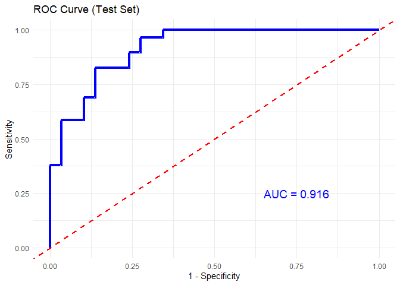
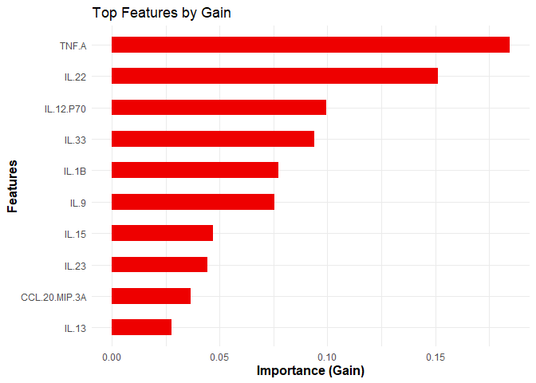
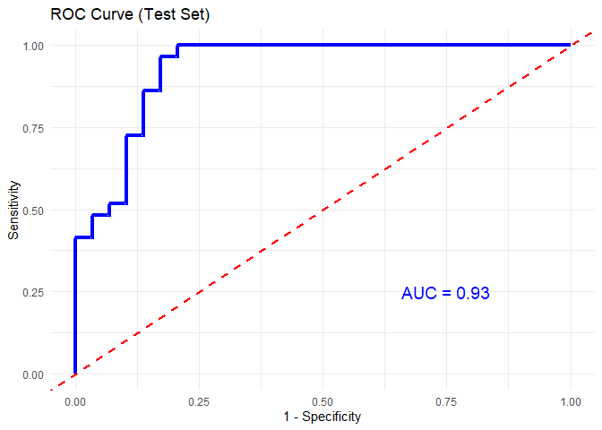
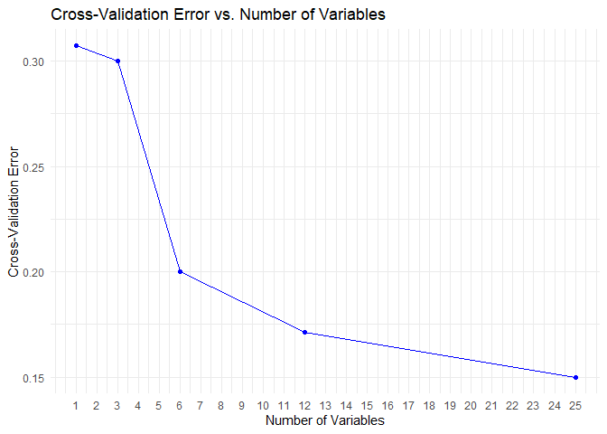

<!-- README.md is generated from README.Rmd. Please edit that file -->

# CytoProfile

<!-- badges: start -->
<!-- badges: end -->

The goal of CytoProfile is to conduct quality control using biological
meaningful cutoff on raw measured values of cytokines. Specifically,
test on distributional symmetry to suggest the adopt of transformation.
Conduct exploratory analysis including summary statistics, generate
enriched barplots, and boxplots. Further, conduct univariate analysis
and multivariate analysis for advance analysis.

## Installation

Before installation of the CytoProfile package, make sure to install
BiocManager and mix0mics packages using:

``` r
## install BiocManager
if (!requireNamespace("BiocManager", quietly = TRUE)) install.packages("BiocManager") 
## install mixOmics 
BiocManager::install('mixOmics')
```

You can install the development version of CytoProfile from
[GitHub](https://github.com/saraswatsh/CytoProfile) with:

``` r
# install.packages("devtools")
devtools::install_github("saraswatsh/CytoProfile")
```

## Example

Below are examples of using the functions provided in CytoProfile. Any
saved files whether PDF or PNG is available in the output folder.

## 1. Data Loading and set up

``` r
# Loading all packages required
# Data manipulation and reshaping
library(dplyr)       # For data filtering, grouping, and summarising.
library(tidyr)       # For reshaping data (e.g., pivot_longer, pivot_wider).

# Plotting and visualization
library(ggplot2)     # For creating all the ggplot-based visualizations.
library(ggrepel)     # For improved label placement in plots (e.g., volcano plots).
library(gplots)      # For heatmap.2, which is used to generate heatmaps.
library(plot3D)      # For creating 3D scatter plots in PCA and sPLS-DA analyses.
library(reshape2)    # For data transformation (e.g., melt) in cross-validation plots.

# Statistical analysis
library(mixOmics)    # For multivariate analyses (PCA, sPLS-DA, etc.).
library(moments)     # For computing skewness and kurtosis.
library(pROC)        # For ROC curve generation in machine learning model evaluation.

# Machine learning
library(xgboost)     # For building XGBoost classification models.
library(randomForest) # For building Random Forest classification models.
library(caret)       # For cross-validation and other machine learning utilities.

# Package development and document rendering
library(knitr)       # For knitting RMarkdown files and setting chunk options.
library(devtools)    # For installing the development version of the package from GitHub.

# devtools::install_github("saraswatsh/CytoProfile")
library(CytoProfile)

# Loading in data
data("cytodata")
data.df <- cytodata

## Setting working directory to output folder to save the PDF files. 
opts_knit$set(root.dir = "E:/Desktop/RA/R Package/CytoProfile/output")
```

## 2. Exploratory Data Analysis

### Boxplots

``` r
# Generating boxplots to check for outliers for raw values
cyt.bp(data.df[,-c(1:4)], Title = "Boxplot.byCytokine.Raw.pdf") # We are removing the first 4 columns as we only want the continuous variables. 
#> png 
#>   2

# Generating boxplots to check for outliers for log2 values
cyt.bp(log2(data.df[,-c(1:4)]), Title = "Boxplot.byCytokine.log2.pdf") # Make sure to use log2 to transform the cytokines and same reason as above for removing initial columns
#> png 
#>   2
```

### Group-Specific Boxplots

``` r
# Second function for generating boxplots
# Raw values
cyt.bp2(data.df[,-c(1,4)], Title = "Boxplot.byGroupandTreatment.raw.pdf", scale = NULL)
#> png 
#>   2
# Log-2 transformation
cyt.bp2(data.df[,-c(1,4)], Title = "Boxplot.byGroupandTreatment.log2.pdf", scale = "log2")
#> png 
#>   2
```

## 3. Skewness and Kurtosis

``` r
# Generating histograms for skewness and kurtosis based on raw values and log2 transformation
cyt.skku(data.df[,-c(1,4)], Title = "Skew and Kurtosis.pdf")
```

## 4. Error Bar Plots

### Basic Error Bar Plot

``` r
# Generating Error Bar Plot
cytokine.mat <- cytodata[, -c(1:4)] # Extracting all cytokines to be stored in one object
cytokineNames <- colnames(cytokine.mat) # Extracting the cytokine names
nCytokine <- length(cytokineNames) # Obtaining the total number of cytokines
results <- cyt.skku(cytodata[,-c(1,4)], printResLog = TRUE) # Extracting values
#> [1] "Results for Log2 Transformed Values:/n"
pdf( "barErrorPlot.pdf" )
par(mfrow=c(2,2), mar=c(8.1,  4.1, 4.1, 2.1) )
for( k in 1:nCytokine ) {
  center.df <- data.frame( "name"=rownames(results[,,k]), results[,,k] )
  cyt.errbp(center.df, pLab=FALSE, esLab=FALSE, classSymbol=TRUE,
               ylab="Concentration in log2 scale",  main=cytokineNames[k] )
}
dev.off()
#> png 
#>   2
```

### Enriched Error Bar Plot with p-values and Effect Sizes

``` r
# Generating Error Bar Plot enriched with p-value and effect size 
data.df <- cytodata[,-1]
cyt.mat <- log2(data.df[,-c(1:3)])
data.df1 <- data.frame(data.df[,c(1:3)], cyt.mat)
cytokineNames <- colnames(cyt.mat)
nCytokine <- length(cytokineNames)
condt <- !is.na(cyt.mat) & cyt.mat >0
Cutoff <- min(cyt.mat[condt], na.rm=TRUE)/10
# Creating a matrix for p-values from anova tests
p.aov.mat <- matrix(NA, nrow=nCytokine, ncol=3)
# Changing column names
dimnames(p.aov.mat) <- list( cytokineNames, c("Group", "Treatment", "Interaction") )
# Matrix to extract p-values from Tukey group comparison
p.groupComp.mat <- matrix(NA, nrow=nCytokine, ncol=3)
# Changing column names
dimnames(p.groupComp.mat) <- list( cytokineNames, c("2-1", "3-1", "3-2") )
# Matrix for SSMD same size as other matrices
ssmd.groupComp.stm.mat <- mD.groupComp.stm.mat <- p.groupComp.stm.mat <- p.groupComp.mat

for( i in 1:nCytokine ) {
   #i <- 1 # i<-2
  Cytokine <- (cyt.mat[,i]+Cutoff)
  cytokine.aov <- aov( Cytokine ~ Group * Treatment, data=data.df)
  aov.table <- summary(cytokine.aov)[[1]]
  p.aov.mat[i,] <- aov.table[1:3,5]
  p.groupComp.mat[i,] <- TukeyHSD(cytokine.aov)$Group[1:3,4]
  p.groupComp.stm.mat[i,] <- TukeyHSD(cytokine.aov)$`Group:Treatment`[c(1:3),4]
  mD.groupComp.stm.mat[i,] <- TukeyHSD(cytokine.aov)$`Group:Treatment`[c(1:3),1]
  ssmd.groupComp.stm.mat[i,]<-mD.groupComp.stm.mat[i,]/sqrt(2*aov.table["Residuals","Mean Sq"])
}

results <- cyt.skku(cytodata[,-c(1,4)], printResLog = TRUE)
#> [1] "Results for Log2 Transformed Values:/n"
pdf( "barErrorPlot.enriched.pdf" )
par(mfrow=c(2,3), mar=c(8.1,  4.1, 4.1, 2.1) )
for( k in 1:nCytokine ) {
  #k <- 1
  result.mat <- results[1:9,,k]
  center.df <-
    data.frame( "name"=rownames(result.mat), result.mat[, c("center", "spread")],
                "p.value"= c(1,p.groupComp.stm.mat[k,1:2]),
                "effect.size"=c(0,ssmd.groupComp.stm.mat[k,1:2])
    )
  cyt.errbp(center.df, pLab=TRUE, esLab=TRUE, classSymbol=TRUE,
               ylab="Concentration in log2 scale", main=cytokineNames[k])
}
dev.off()
#> png 
#>   2
```

## 5. Univariate Analysis

### Two Sample T-test and Mann Whitney U Test

``` r
# Performing Two Sample T-test and Mann Whitney U Test
data.df <- cytodata[,-c(1,4)]
data.df <- filter(data.df, Group != "ND", Treatment != "Unstimulated")
# Two sample T-test
cyt.ttests(data.df, scale = "log2")
#> T-test p-value for PreT2D vs T2D on IL.17F: 0.422939563509921
#> T-test p-value for PreT2D vs T2D on GM.CSF: 0.640213842858851
#> T-test p-value for PreT2D vs T2D on IFN.G: 0.020823953738953
#> T-test p-value for PreT2D vs T2D on IL.10: 0.0248419503583982
#> T-test p-value for PreT2D vs T2D on CCL.20.MIP.3A: 1.05652747898593e-07
#> T-test p-value for PreT2D vs T2D on IL.12.P70: 0.000462802087516377
#> T-test p-value for PreT2D vs T2D on IL.13: 0.977511396213605
#> T-test p-value for PreT2D vs T2D on IL.15: 0.00709989171799444
#> T-test p-value for PreT2D vs T2D on IL.17A: 0.977594978364051
#> T-test p-value for PreT2D vs T2D on IL.22: 0.0953377169338354
#> T-test p-value for PreT2D vs T2D on IL.9: 0.833861140930955
#> T-test p-value for PreT2D vs T2D on IL.1B: 0.000566862271316051
#> T-test p-value for PreT2D vs T2D on IL.33: 0.922832629072384
#> T-test p-value for PreT2D vs T2D on IL.2: 0.897267459322106
#> T-test p-value for PreT2D vs T2D on IL.21: 0.146339395993712
#> T-test p-value for PreT2D vs T2D on IL.4: 0.149006740397168
#> T-test p-value for PreT2D vs T2D on IL.23: 0.964667232639956
#> T-test p-value for PreT2D vs T2D on IL.5: 0.423582860000592
#> T-test p-value for PreT2D vs T2D on IL.6: 0.00232363071577129
#> Skipping test due to low variance in IL.17E.IL.25 
#> T-test p-value for PreT2D vs T2D on IL.27: 0.0592678660937652
#> T-test p-value for PreT2D vs T2D on IL.31: 0.0346896919700123
#> T-test p-value for PreT2D vs T2D on TNF.A: 0.081758569241274
#> T-test p-value for PreT2D vs T2D on TNF.B: 0.950354075844566
#> T-test p-value for PreT2D vs T2D on IL.28A: 0.98266022927896
#> T-test p-value for CD3/CD28 vs LPS on IL.17F: 3.15478761348163e-31
#> T-test p-value for CD3/CD28 vs LPS on GM.CSF: 5.71686822918306e-09
#> T-test p-value for CD3/CD28 vs LPS on IFN.G: 7.30960263330573e-22
#> T-test p-value for CD3/CD28 vs LPS on IL.10: 0.000140229141772713
#> T-test p-value for CD3/CD28 vs LPS on CCL.20.MIP.3A: 0.0780039334429007
#> T-test p-value for CD3/CD28 vs LPS on IL.12.P70: 0.00173352096663525
#> T-test p-value for CD3/CD28 vs LPS on IL.13: 1.59009641224272e-34
#> T-test p-value for CD3/CD28 vs LPS on IL.15: 7.47478289354263e-07
#> T-test p-value for CD3/CD28 vs LPS on IL.17A: 2.54969928791167e-37
#> T-test p-value for CD3/CD28 vs LPS on IL.22: 1.08637893603037e-13
#> T-test p-value for CD3/CD28 vs LPS on IL.9: 2.11288766131603e-31
#> T-test p-value for CD3/CD28 vs LPS on IL.1B: 0.00172254277518451
#> T-test p-value for CD3/CD28 vs LPS on IL.33: 4.98670884745259e-07
#> T-test p-value for CD3/CD28 vs LPS on IL.2: 1.65045851085779e-42
#> T-test p-value for CD3/CD28 vs LPS on IL.21: 9.84381615242624e-11
#> T-test p-value for CD3/CD28 vs LPS on IL.4: 2.09768024368801e-23
#> T-test p-value for CD3/CD28 vs LPS on IL.23: 0.003962411047315
#> T-test p-value for CD3/CD28 vs LPS on IL.5: 1.9301420263009e-28
#> T-test p-value for CD3/CD28 vs LPS on IL.6: 0.480947271765423
#> Skipping test due to low variance in IL.17E.IL.25 
#> T-test p-value for CD3/CD28 vs LPS on IL.27: 0.000534071516220325
#> T-test p-value for CD3/CD28 vs LPS on IL.31: 4.71672784129416e-17
#> T-test p-value for CD3/CD28 vs LPS on TNF.A: 1.72872730806301e-07
#> T-test p-value for CD3/CD28 vs LPS on TNF.B: 9.10789211896627e-32
#> T-test p-value for CD3/CD28 vs LPS on IL.28A: 5.27051208036701e-07
# Mann Whitney U Test
cyt.ttests(data.df)
#> Mann-Whitney U test p-value for PreT2D vs T2D on IL.17F: 0.421868950350848
#> Mann-Whitney U test p-value for PreT2D vs T2D on GM.CSF: 0.552522578663034
#> Mann-Whitney U test p-value for PreT2D vs T2D on IFN.G: 0.00846249337760339
#> Mann-Whitney U test p-value for PreT2D vs T2D on IL.10: 0.0119136263675125
#> Mann-Whitney U test p-value for PreT2D vs T2D on CCL.20.MIP.3A: 2.91054284908639e-07
#> Mann-Whitney U test p-value for PreT2D vs T2D on IL.12.P70: 0.00163308433285844
#> Mann-Whitney U test p-value for PreT2D vs T2D on IL.13: 0.574068105550945
#> Mann-Whitney U test p-value for PreT2D vs T2D on IL.15: 0.00016338463811738
#> Mann-Whitney U test p-value for PreT2D vs T2D on IL.17A: 0.998149768651504
#> Mann-Whitney U test p-value for PreT2D vs T2D on IL.22: 0.0613997616837295
#> Mann-Whitney U test p-value for PreT2D vs T2D on IL.9: 0.525483425319374
#> Mann-Whitney U test p-value for PreT2D vs T2D on IL.1B: 0.00172717180980661
#> Mann-Whitney U test p-value for PreT2D vs T2D on IL.33: 0.397254286703658
#> Mann-Whitney U test p-value for PreT2D vs T2D on IL.2: 0.746614520285629
#> Mann-Whitney U test p-value for PreT2D vs T2D on IL.21: 0.477716048537159
#> Mann-Whitney U test p-value for PreT2D vs T2D on IL.4: 0.172875479981857
#> Mann-Whitney U test p-value for PreT2D vs T2D on IL.23: 0.972476915197134
#> Mann-Whitney U test p-value for PreT2D vs T2D on IL.5: 0.32536294875658
#> Mann-Whitney U test p-value for PreT2D vs T2D on IL.6: 7.40414125739882e-05
#> Skipping test due to low variance in IL.17E.IL.25 
#> Mann-Whitney U test p-value for PreT2D vs T2D on IL.27: 0.108633824389273
#> Mann-Whitney U test p-value for PreT2D vs T2D on IL.31: 0.1215062263387
#> Mann-Whitney U test p-value for PreT2D vs T2D on TNF.A: 0.00911097614923371
#> Mann-Whitney U test p-value for PreT2D vs T2D on TNF.B: 0.939885549533893
#> Mann-Whitney U test p-value for PreT2D vs T2D on IL.28A: 0.856934115112329
#> Mann-Whitney U test p-value for CD3/CD28 vs LPS on IL.17F: 1.42823313991057e-19
#> Mann-Whitney U test p-value for CD3/CD28 vs LPS on GM.CSF: 1.4413325671106e-12
#> Mann-Whitney U test p-value for CD3/CD28 vs LPS on IFN.G: 5.91528064522474e-19
#> Mann-Whitney U test p-value for CD3/CD28 vs LPS on IL.10: 3.2782201468954e-05
#> Mann-Whitney U test p-value for CD3/CD28 vs LPS on CCL.20.MIP.3A: 0.131956404765558
#> Mann-Whitney U test p-value for CD3/CD28 vs LPS on IL.12.P70: 0.000213072490809883
#> Mann-Whitney U test p-value for CD3/CD28 vs LPS on IL.13: 9.61209359732893e-20
#> Mann-Whitney U test p-value for CD3/CD28 vs LPS on IL.15: 5.28302247711846e-07
#> Mann-Whitney U test p-value for CD3/CD28 vs LPS on IL.17A: 8.71793255441275e-22
#> Mann-Whitney U test p-value for CD3/CD28 vs LPS on IL.22: 5.60221278044707e-12
#> Mann-Whitney U test p-value for CD3/CD28 vs LPS on IL.9: 1.74545072698478e-21
#> Mann-Whitney U test p-value for CD3/CD28 vs LPS on IL.1B: 1.32836093769345e-07
#> Mann-Whitney U test p-value for CD3/CD28 vs LPS on IL.33: 3.34712231385806e-11
#> Mann-Whitney U test p-value for CD3/CD28 vs LPS on IL.2: 1.91352971348874e-22
#> Mann-Whitney U test p-value for CD3/CD28 vs LPS on IL.21: 6.29946819640946e-10
#> Mann-Whitney U test p-value for CD3/CD28 vs LPS on IL.4: 6.49809855939832e-17
#> Mann-Whitney U test p-value for CD3/CD28 vs LPS on IL.23: 0.00252718241087377
#> Mann-Whitney U test p-value for CD3/CD28 vs LPS on IL.5: 2.51612668159609e-19
#> Mann-Whitney U test p-value for CD3/CD28 vs LPS on IL.6: 0.0130148210700095
#> Skipping test due to low variance in IL.17E.IL.25 
#> Mann-Whitney U test p-value for CD3/CD28 vs LPS on IL.27: 0.000584083581151205
#> Mann-Whitney U test p-value for CD3/CD28 vs LPS on IL.31: 3.06708770248274e-18
#> Mann-Whitney U test p-value for CD3/CD28 vs LPS on TNF.A: 2.70877378492254e-17
#> Mann-Whitney U test p-value for CD3/CD28 vs LPS on TNF.B: 2.65495930966719e-23
#> Mann-Whitney U test p-value for CD3/CD28 vs LPS on IL.28A: 1.66729791608952e-08
```

### ANOVA Comparisons Test

``` r
# Performing ANOVA comparisons test for univariate analysis
cyt.anova(data.df[,c(1:2,5:6)]) # This only considers 2 cytokines for this example only
#> $IFN.G_Group
#> [1] 0.00356939
#> 
#> $IL.10_Group
#> [1] 0.003323717
#> 
#> $IFN.G_Treatment
#> [1] 3.805612e-08
#> 
#> $IL.10_Treatment
#> [1] 0.0002059574
```

## 6. Multivariate Analysis

### Partial Least Squares Discriminant Analysis (PLS-DA)

``` r
# In this code, we will have background predict to be turned on to see the classification areas and 
# we will also print out the confusion matrix based on classification. 
# Note this takes into account all groups and treatment and all values are log transformed through 
# cyt.plsda function. 
data.df <- cytodata
cyt.plsda(data.df[,-c(1,4)], title = "Example PLS-DA Analysis.pdf", 
          colors = c("black", "purple", "red2"),
          bg = TRUE, scale = "log2", 
          conf.mat = TRUE, var.num = 25, 
          cv.opt = "loocv",
          comp.num = 2, pch.values = c(16, 4, 3), 
          group.col = "Group", trt.col = "Treatment", roc = TRUE)
#> [1] "Results based on log2 transformation:"
#> [1] "CD3/CD28 LOOCV Accuracy: 49%"
#> [1] "CD3/CD28 LOOCV Accuracy (VIP>1): 52%"
#> [1] "CD3/CD28 Confusion Matrix for PLS-DA Comparison"
#>           Reference
#> Prediction ND PreT2D T2D
#>     ND      0      0   1
#>     PreT2D 15     28   5
#>     T2D    18      5  27
#> Accuracy 
#>     0.56 
#> [1] NA
#> [1] NA
#> [1] "CD3/CD28 Confusion Matrix for PLS-DA Comparison with VIP Score > 1"
#>           Reference
#> Prediction ND PreT2D T2D
#>     ND      0      0   1
#>     PreT2D 17     27   7
#>     T2D    16      6  25
#> Accuracy 
#>     0.53 
#> [1] NA
#> [1] NA
#> [1] "LPS LOOCV Accuracy: 44%"
#> [1] "LPS LOOCV Accuracy (VIP>1): 44%"
#> [1] "LPS Confusion Matrix for PLS-DA Comparison"
#>           Reference
#> Prediction ND PreT2D T2D
#>     ND     13      4   9
#>     PreT2D 12     21   5
#>     T2D     8      8  19
#> Accuracy 
#>     0.54 
#> [1] NA
#> [1] NA
#> [1] "LPS Confusion Matrix for PLS-DA Comparison with VIP Score > 1"
#>           Reference
#> Prediction ND PreT2D T2D
#>     ND     13      4   7
#>     PreT2D 14     22   5
#>     T2D     6      7  21
#> Accuracy 
#>     0.57 
#> [1] NA
#> [1] NA
#> [1] "Unstimulated LOOCV Accuracy: 34%"
#> [1] "Unstimulated LOOCV Accuracy (VIP>1): 42%"
#> [1] "Unstimulated Confusion Matrix for PLS-DA Comparison"
#>           Reference
#> Prediction ND PreT2D T2D
#>     ND      6      4   6
#>     PreT2D 13     27   9
#>     T2D    14      2  18
#> Accuracy 
#>     0.52 
#> [1] NA
#> [1] NA
#> [1] "Unstimulated Confusion Matrix for PLS-DA Comparison with VIP Score > 1"
#>           Reference
#> Prediction ND PreT2D T2D
#>     ND      8      4   7
#>     PreT2D 12     22   5
#>     T2D    13      7  21
#> Accuracy 
#>     0.52 
#> [1] NA
#> [1] NA
#> png 
#>   2

# Filtering data for specific groups and treatment
filt.data <- filter(data.df, Group != "ND", Treatment != "Unstimulated")
cyt.plsda(filt.data[,-c(1,4)], title = "Example PLS-DA Analysis 2.pdf", 
          colors = c("black", "purple"),
          bg = TRUE, scale = "log2", 
          conf.mat = TRUE, var.num = 25, 
          cv.opt = "Mfold", fold.num = 5,
          comp.num = 3, pch.values = c(3, 4), style = "3d",
          group.col = "Group", trt.col = "Treatment", roc = TRUE)
#> [1] "Results based on log2 transformation:"
#> [1] "CD3/CD28 Mfold Accuracy: 79%"
#> [1] "CD3/CD28 Mfold Accuracy (VIP>1): 78%"
#> [1] "CD3/CD28 Confusion Matrix for PLS-DA Comparison"
#>           Reference
#> Prediction PreT2D T2D
#>     PreT2D     28   7
#>     T2D         5  26
#> Accuracy 
#>     0.82 
#> Sensitivity 
#>        0.85 
#> Specificity 
#>        0.79 
#> [1] "CD3/CD28 Confusion Matrix for PLS-DA Comparison with VIP Score > 1"
#>           Reference
#> Prediction PreT2D T2D
#>     PreT2D     27   6
#>     T2D         6  27
#> Accuracy 
#>     0.82 
#> Sensitivity 
#>        0.82 
#> Specificity 
#>        0.82
#> [1] "LPS Mfold Accuracy: 72%"
#> [1] "LPS Mfold Accuracy (VIP>1): 78%"
#> [1] "LPS Confusion Matrix for PLS-DA Comparison"
#>           Reference
#> Prediction PreT2D T2D
#>     PreT2D     25   4
#>     T2D         8  29
#> Accuracy 
#>     0.82 
#> Sensitivity 
#>        0.76 
#> Specificity 
#>        0.88 
#> [1] "LPS Confusion Matrix for PLS-DA Comparison with VIP Score > 1"
#>           Reference
#> Prediction PreT2D T2D
#>     PreT2D     28   8
#>     T2D         5  25
#> Accuracy 
#>      0.8 
#> Sensitivity 
#>        0.85 
#> Specificity 
#>        0.76
#> png 
#>   2
```

## 7. Principal Component Analysis (PCA)

``` r
data <- cytodata[,-c(1,4)]
data.df <- filter(data, Group != "ND" & Treatment != "Unstimulated")
data.df <- data.df[,-22]
cyt.pca(data.df, title = "Example PCA Analysis.pdf" ,colors = c("black", "red2"), scale = "log2", comp.num = 3, pch.values = c(16,4), style = "3D")
#> [1] "Results based on log2 transformation:"
#> png 
#>   2
```

## 8. Volcano Plot

``` r
# Generating Volcano Plot
data.df <- cytodata[,-4]
volc_plot <- cyt.volc(data.df, "Group", cond1 = "T2D", cond2 = "ND", fold_change_thresh = 2.0, top_labels= 15)
#>                    Cytokine      FC_Log      P_Log Significant
#> IL.12.P70         IL.12.P70 -2.60117683 2.18641971        TRUE
#> IL.6                   IL.6 -0.95013174 3.94758527       FALSE
#> IL.27                 IL.27 -0.67878724 2.33099419       FALSE
#> IL.23                 IL.23 -0.87320747 1.95290632       FALSE
#> CCL.20.MIP.3A CCL.20.MIP.3A -0.48569948 1.40917287       FALSE
#> IL.2                   IL.2 -0.80577278 1.22848122       FALSE
#> IL.17F               IL.17F -0.93024059 1.16938373       FALSE
#> IL.10                 IL.10 -0.48121242 1.01734902       FALSE
#> IL.28A               IL.28A -0.31081278 0.98351262       FALSE
#> IL.17A               IL.17A -0.80415853 0.90173665       FALSE
#> IL.1B                 IL.1B -0.61564856 0.83381951       FALSE
#> GM.CSF               GM.CSF  0.45980342 0.62042612       FALSE
#> IL.21                 IL.21 -0.62254771 0.51843946       FALSE
#> IL.17E.IL.25   IL.17E.IL.25  0.01449957 0.49515782       FALSE
#> IL.22                 IL.22 -0.30363695 0.47550506       FALSE
#> IL.9                   IL.9 -0.32752255 0.43117675       FALSE
#> TNF.A                 TNF.A -0.15647551 0.21142412       FALSE
#> IL.31                 IL.31  0.21056699 0.20929529       FALSE
#> IL.4                   IL.4  0.21161574 0.20542291       FALSE
#> IL.5                   IL.5 -0.20808037 0.17512546       FALSE
#> IL.15                 IL.15 -0.05298748 0.12055764       FALSE
#> IL.13                 IL.13 -0.07717527 0.06654004       FALSE
#> IFN.G                 IFN.G -0.09088794 0.06221451       FALSE
#> TNF.B                 TNF.B  0.07037796 0.05224667       FALSE
#> IL.33                 IL.33  0.01213249 0.01719622       FALSE
ggsave("VolcanoPlot.png", plot = volc_plot$`T2D vs ND`, dpi = 300)

# Printing table (This is usually printed by default when the function is called and not saved as an object.)
print(volc_plot$`T2D vs ND`$data)
#>                    Cytokine      FC_Log      P_Log Significant         Label
#> IL.12.P70         IL.12.P70 -2.60117683 2.18641971        TRUE     IL.12.P70
#> IL.6                   IL.6 -0.95013174 3.94758527       FALSE          IL.6
#> IL.27                 IL.27 -0.67878724 2.33099419       FALSE         IL.27
#> IL.23                 IL.23 -0.87320747 1.95290632       FALSE         IL.23
#> CCL.20.MIP.3A CCL.20.MIP.3A -0.48569948 1.40917287       FALSE CCL.20.MIP.3A
#> IL.2                   IL.2 -0.80577278 1.22848122       FALSE          IL.2
#> IL.17F               IL.17F -0.93024059 1.16938373       FALSE        IL.17F
#> IL.10                 IL.10 -0.48121242 1.01734902       FALSE         IL.10
#> IL.28A               IL.28A -0.31081278 0.98351262       FALSE        IL.28A
#> IL.17A               IL.17A -0.80415853 0.90173665       FALSE        IL.17A
#> IL.1B                 IL.1B -0.61564856 0.83381951       FALSE         IL.1B
#> GM.CSF               GM.CSF  0.45980342 0.62042612       FALSE        GM.CSF
#> IL.21                 IL.21 -0.62254771 0.51843946       FALSE         IL.21
#> IL.17E.IL.25   IL.17E.IL.25  0.01449957 0.49515782       FALSE  IL.17E.IL.25
#> IL.22                 IL.22 -0.30363695 0.47550506       FALSE         IL.22
#> IL.9                   IL.9 -0.32752255 0.43117675       FALSE              
#> TNF.A                 TNF.A -0.15647551 0.21142412       FALSE              
#> IL.31                 IL.31  0.21056699 0.20929529       FALSE              
#> IL.4                   IL.4  0.21161574 0.20542291       FALSE              
#> IL.5                   IL.5 -0.20808037 0.17512546       FALSE              
#> IL.15                 IL.15 -0.05298748 0.12055764       FALSE              
#> IL.13                 IL.13 -0.07717527 0.06654004       FALSE              
#> IFN.G                 IFN.G -0.09088794 0.06221451       FALSE              
#> TNF.B                 TNF.B  0.07037796 0.05224667       FALSE              
#> IL.33                 IL.33  0.01213249 0.01719622       FALSE
```

## 9. Heatmap

``` r
# Generating Heat map
cyt.heatmap(data = data.df,
                    scale = "log2",        # Optional scaling
                    annotation_col_name = "Group",
                    title = "Heatmap.png")
#> png 
#>   2
```

## 10. Dual Flashlight Plot

``` r
# Generating dual flashlights plot
data.df <- cytodata[,-c(1,3:4)]

dfp <- cyt.dualflashplot(data.df, group_var = "Group", group1 = "T2D", group2 = "ND", 
                  ssmd_thresh = -0.2, log2fc_thresh = 1, top_labels = 10)
#> # A tibble: 25 × 11
#>    cytokine         mean_ND mean_PreT2D   mean_T2D variance_ND variance_PreT2D
#>    <chr>              <dbl>       <dbl>      <dbl>       <dbl>           <dbl>
#>  1 CCL.20.MIP.3A   634.        404.       887.        6.72e+ 5         2.74e+5
#>  2 GM.CSF            2.65        3.11       1.92      2.63e+ 1         3.14e+1
#>  3 IFN.G         57730.      18303.     61484.        2.86e+10         2.30e+9
#>  4 IL.10           979.        836.      1366.        1.99e+ 6         1.19e+6
#>  5 IL.12.P70        13.0        39.1       78.9       4.15e+ 2         2.56e+4
#>  6 IL.13          1064.       1543.      1122.        5.60e+ 6         1.11e+7
#>  7 IL.15             7.92        4.29       8.22      3.54e+ 1         2.58e+1
#>  8 IL.17A          352.        653.       615.        9.40e+ 5         2.88e+6
#>  9 IL.17E.IL.25      0.0101      0.0163     0.01      1.01e- 6         3.88e-3
#> 10 IL.17F            1.63        2.35       3.11      1.56e+ 1         3.37e+1
#> 11 IL.1B          2806.       2977.      4299.        6.63e+ 7         3.76e+7
#> 12 IL.2           9227.      10718.     16129.        2.60e+ 8         4.10e+8
#> 13 IL.21           205.        210.       316.        3.15e+ 5         2.49e+5
#> 14 IL.22             0.0513      0.0684     0.0633    4.58e- 3         4.51e-3
#> 15 IL.23             0.147       0.243      0.269     3.13e- 2         9.37e-2
#> 16 IL.27             0.0662      0.0834     0.106     6.18e- 3         5.66e-3
#> 17 IL.28A            0.0537      0.0710     0.0666    2.45e- 3         5.10e-3
#> 18 IL.31             0.0409      0.0905     0.0354    6.62e- 3         4.88e-2
#> 19 IL.33             1.17        1.43       1.16      2.09e+ 0         2.71e+0
#> 20 IL.4              0.344       0.707      0.297     4.24e- 1         2.96e+0
#> 21 IL.5            134.        340.       155.        1.09e+ 5         9.88e+5
#> 22 IL.6           4620.       5197.      8925.        2.86e+ 7         5.72e+7
#> 23 IL.9            203.        256.       254.        1.34e+ 5         2.11e+5
#> 24 TNF.A          5046.       3069.      5624.        7.02e+ 7         1.63e+7
#> 25 TNF.B             0.641       0.709      0.610     2.37e+ 0         2.76e+0
#> # ℹ 5 more variables: variance_T2D <dbl>, ssmd <dbl>, log2FC <dbl>,
#> #   SSMD_Category <chr>, Significant <lgl>
ggsave("DualFlashlightPlot.png", plot = dfp$plot_env$p, dpi = 300, width = 3000, height = 2000, units = "px")

# Printing table (This is usually printed by default when the function is called and not saved as an object.)
print(dfp$data)
#> # A tibble: 25 × 11
#>    cytokine         mean_ND mean_PreT2D mean_T2D variance_ND variance_PreT2D
#>    <chr>              <dbl>       <dbl>    <dbl>       <dbl>           <dbl>
#>  1 CCL.20.MIP.3A   634.        404.       887.      6.72e+ 5         2.74e+5
#>  2 GM.CSF            2.65        3.11       1.92    2.63e+ 1         3.14e+1
#>  3 IFN.G         57730.      18303.     61484.      2.86e+10         2.30e+9
#>  4 IL.10           979.        836.      1366.      1.99e+ 6         1.19e+6
#>  5 IL.12.P70        13.0        39.1       78.9     4.15e+ 2         2.56e+4
#>  6 IL.13          1064.       1543.      1122.      5.60e+ 6         1.11e+7
#>  7 IL.15             7.92        4.29       8.22    3.54e+ 1         2.58e+1
#>  8 IL.17A          352.        653.       615.      9.40e+ 5         2.88e+6
#>  9 IL.17E.IL.25      0.0101      0.0163     0.01    1.01e- 6         3.88e-3
#> 10 IL.17F            1.63        2.35       3.11    1.56e+ 1         3.37e+1
#> # ℹ 15 more rows
#> # ℹ 5 more variables: variance_T2D <dbl>, ssmd <dbl>, log2FC <dbl>,
#> #   SSMD_Category <chr>, Significant <lgl>
```

## 11. Machine Learning Models

### Using XGBoost for classification

``` r
data.df0 <- cytodata
data.df <- data.frame(data.df0[,1:4], log2(data.df0[,-c(1:4)]))
data.df <- data.df[,-c(1,3,4)]
data.df <- filter(data.df, Group != "ND")

xgb.results <- cyt.xgb(data = data.df, group_col = 'Group',
                   nrounds = 500, max_depth = 4, eta = 0.05,
                   nfold = 5, cv = TRUE, eval_metric = "mlogloss",
                   early_stopping_rounds = NULL, top_n_features = 10,
                   verbose = 0, plot_roc = TRUE)
#> 
#> ### Group to Numeric Label Mapping ###
#> PreT2D    T2D 
#>      0      1 
#> 
#> ### TRAINING XGBOOST MODEL ###
#> 
#> Best iteration from training (based on mlogloss ):
#>     iter train_mlogloss test_mlogloss
#>    <num>          <num>         <num>
#> 1:   313     0.01860717     0.4529601
#> 
#> AUC:  0.9155767
```



    #> 
    #> ### Confusion Matrix on Test Set ###
    #> Confusion Matrix and Statistics
    #> 
    #>           Reference
    #> Prediction  0  1
    #>          0 25  7
    #>          1  4 22
    #>                                           
    #>                Accuracy : 0.8103          
    #>                  95% CI : (0.6859, 0.9013)
    #>     No Information Rate : 0.5             
    #>     P-Value [Acc > NIR] : 1.016e-06       
    #>                                           
    #>                   Kappa : 0.6207          
    #>                                           
    #>  Mcnemar's Test P-Value : 0.5465          
    #>                                           
    #>             Sensitivity : 0.8621          
    #>             Specificity : 0.7586          
    #>          Pos Pred Value : 0.7812          
    #>          Neg Pred Value : 0.8462          
    #>              Prevalence : 0.5000          
    #>          Detection Rate : 0.4310          
    #>    Detection Prevalence : 0.5517          
    #>       Balanced Accuracy : 0.8103          
    #>                                           
    #>        'Positive' Class : 0               
    #>                                           
    #> 
    #> ### Top 10 Important Features ###
    #>           Feature       Gain      Cover  Frequency
    #>            <char>      <num>      <num>      <num>
    #>  1:         TNF.A 0.18457678 0.10535233 0.09103448
    #>  2:         IL.22 0.15117263 0.16064281 0.09885057
    #>  3:     IL.12.P70 0.09955532 0.12855158 0.12321839
    #>  4:         IL.33 0.09384522 0.08514973 0.07908046
    #>  5:         IL.1B 0.07717208 0.03835908 0.05149425
    #>  6:          IL.9 0.07554566 0.06955229 0.07080460
    #>  7:         IL.15 0.04705740 0.05853239 0.03310345
    #>  8:         IL.23 0.04440949 0.02533791 0.02988506
    #>  9: CCL.20.MIP.3A 0.03678675 0.05623800 0.05287356
    #> 10:         IL.13 0.02785650 0.02633047 0.03678161



    #> 
    #> ### CROSS-VALIDATION USING XGBOOST ###
    #> 
    #> Best iteration from cross-validation:
    #>     iter train_mlogloss_mean train_mlogloss_std test_mlogloss_mean
    #>    <num>               <num>              <num>              <num>
    #> 1:    45           0.1664957         0.01796909           0.457419
    #>    test_mlogloss_std
    #>                <num>
    #> 1:        0.08743712
    #> Confusion Matrix and Statistics
    #> 
    #>           Reference
    #> Prediction  0  1
    #>          0 57 13
    #>          1 13 57
    #>                                          
    #>                Accuracy : 0.8143         
    #>                  95% CI : (0.7398, 0.875)
    #>     No Information Rate : 0.5            
    #>     P-Value [Acc > NIR] : 1.212e-14      
    #>                                          
    #>                   Kappa : 0.6286         
    #>                                          
    #>  Mcnemar's Test P-Value : 1              
    #>                                          
    #>             Sensitivity : 0.8143         
    #>             Specificity : 0.8143         
    #>          Pos Pred Value : 0.8143         
    #>          Neg Pred Value : 0.8143         
    #>              Prevalence : 0.5000         
    #>          Detection Rate : 0.4071         
    #>    Detection Prevalence : 0.5000         
    #>       Balanced Accuracy : 0.8143         
    #>                                          
    #>        'Positive' Class : 0              
    #>                                          
    #> 
    #> Cross-Validation Accuracy:  0.8142857

### Using Random Forest for classification

``` r
rf.results <- cyt.rf(data = data.df, group_col = 'Group', k_folds = 5,
                  ntree = 1000, mtry = 4, run_rfcv = TRUE, plot_roc = TRUE)
#> 
#> ### RANDOM FOREST RESULTS ON TRAINING SET ###
#> 
#> Call:
#>  randomForest(formula = formula, data = train_data, ntree = ntree,      mtry = mtry, importance = TRUE) 
#>                Type of random forest: classification
#>                      Number of trees: 1000
#> No. of variables tried at each split: 4
#> 
#>         OOB estimate of  error rate: 11.43%
#> Confusion matrix:
#>        PreT2D T2D class.error
#> PreT2D     62   8   0.1142857
#> T2D         8  62   0.1142857
#> 
#> Accuracy on training set:  0.8857143 
#> 
#> Class 'PreT2D' metrics:
#>   Sensitivity:  0.886 
#>   Specificity:  0.886 
#> 
#> Class 'T2D' metrics:
#>   Sensitivity:  0.886 
#>   Specificity:  0.886 
#> 
#> ### PREDICTIONS ON TEST SET ###
#>           Reference
#> Prediction PreT2D T2D
#>     PreT2D     25   7
#>     T2D         4  22
#> 
#> Accuracy on test set:  0.8103448 
#> 
#> Sensitivity by class:
#> Class: PreT2D: 0.862
#> Class: T2D: 0.241
#> 
#> Specificity by class:
#> Class: T2D: 0.759
#> Class: PreT2D: 0.138
#> 
#> AUC:  0.9298454
```



    #> 
    #> ### RANDOM FOREST CROSS-VALIDATION FOR FEATURE SELECTION ###



    #> Random Forest CV completed for feature selection. Check the plot for error vs. number of variables.
