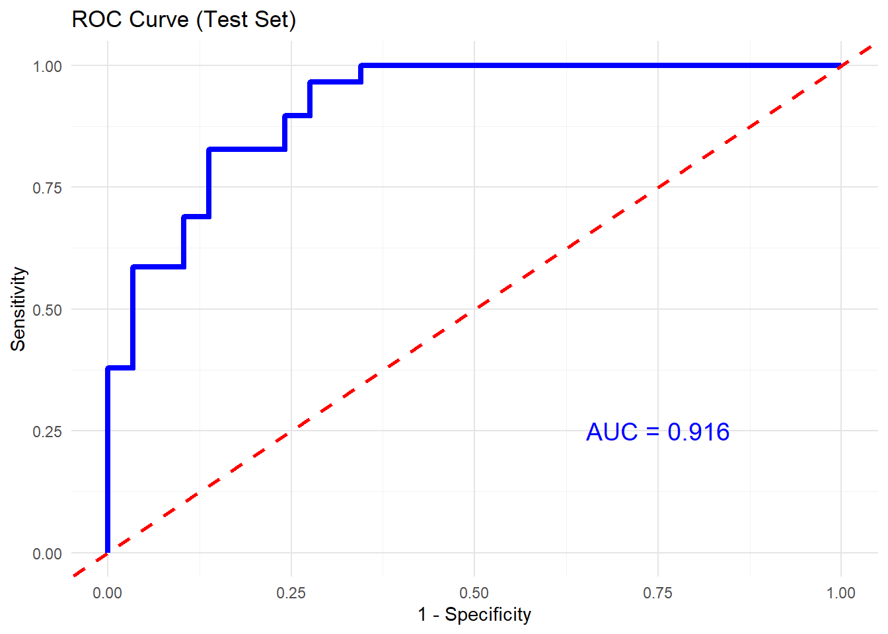
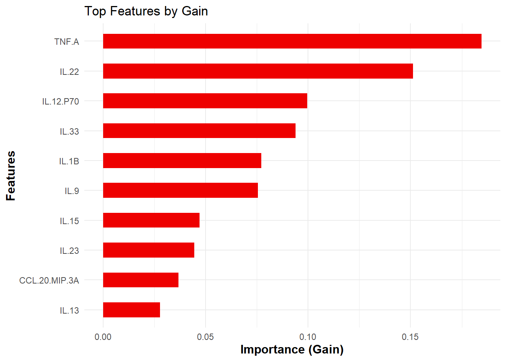
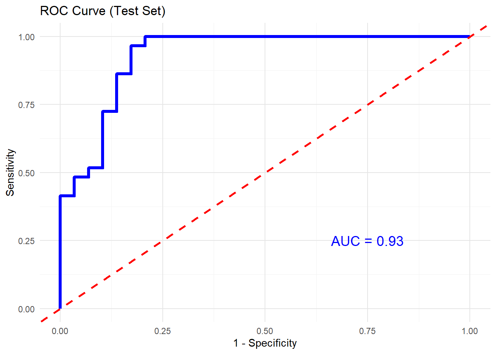
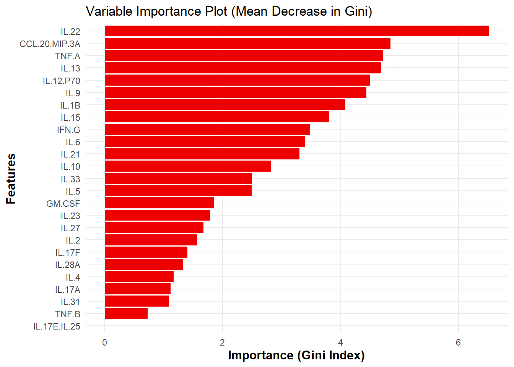
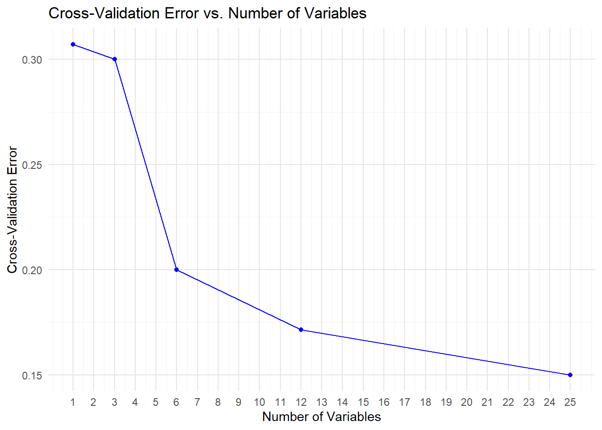

<!-- README.md is generated from README.Rmd. Please edit that file -->
<!-- badges: start -->

[](https://github.com/saraswatsh/CytoProfile/actions/workflows/R-CMD-check.yaml)
<!-- badges: end -->

# CytoProfile

The goal of CytoProfile is to conduct quality control using biological
meaningful cutoff on raw measured values of cytokines. Specifically,
test on distributional symmetry to suggest the adopt of transformation.
Conduct exploratory analysis including summary statistics, generate
enriched barplots, and boxplots. Further, conduct univariate analysis
and multivariate analysis for advance analysis.

## Installation

Before installation of the CytoProfile package, make sure to install
BiocManager and mix0mics packages using:

``` r
## install BiocManager
if (!requireNamespace("BiocManager", quietly = TRUE)) install.packages("BiocManager") 
## install mixOmics 
BiocManager::install('mixOmics')
```

You can install the development version of CytoProfile from
[GitHub](https://github.com/saraswatsh/CytoProfile) with:

``` r
# install.packages("devtools")
devtools::install_github("saraswatsh/CytoProfile")
```

Install CytoProfile from CRAN with:

``` r
install.packages("CytoProfile")
```

## Example

Below are examples of using the functions provided in CytoProfile. Any
saved or generated files that are PDF or PNG format will be found at in
the [Output
Folder](https://github.com/saraswatsh/CytoProfile/tree/main/output).

## 1. Data Loading and set up

``` r
# Loading all packages required
# Data manipulation and reshaping
library(dplyr)       # For data filtering, grouping, and summarising.
library(tidyr)       # For reshaping data (e.g., pivot_longer, pivot_wider).

# Plotting and visualization
library(ggplot2)     # For creating all the ggplot-based visualizations.
library(gridExtra)   # For arranging multiple plots on a single page.
library(ggrepel)     # For improved label placement in plots (e.g., volcano plots).
library(gplots)      # For heatmap.2, which is used to generate heatmaps.
library(plot3D)      # For creating 3D scatter plots in PCA and sPLS-DA analyses.
library(reshape2)    # For data transformation (e.g., melt) in cross-validation plots.

# Statistical analysis
library(mixOmics)    # For multivariate analyses (PCA, sPLS-DA, etc.).
library(e1071)     # For computing skewness and kurtosis.
library(pROC)        # For ROC curve generation in machine learning model evaluation.

# Machine learning
library(xgboost)     # For building XGBoost classification models.
library(randomForest) # For building Random Forest classification models.
library(caret)       # For cross-validation and other machine learning utilities.

# Package development and document rendering
library(knitr)       # For knitting RMarkdown files and setting chunk options.
library(devtools)    # For installing the development version of the package from GitHub.

# devtools::install_github("saraswatsh/CytoProfile")
library(CytoProfile)

# Loading in data
data("ExampleData1")
data_df <- ExampleData1

## Setting working directory to output folder to save the PDF files. 
opts_knit$set(root.dir = "E:/Desktop/RA/R Package/CytoProfile/output")
```

## 2. Exploratory Data Analysis

### Boxplots

``` r
# Generating boxplots to check for outliers for raw values
# Generating boxplots to check for outliers for raw values
cyt_bp(data_df[, -c(1:3)], 
       pdf_title = "boxplot_by_cytokine_raw.pdf")  
#> png 
#>   2
# Removing the first 4 columns to retain only continuous variables.

# Generating boxplots to check for outliers for log2 values
cyt_bp(log2(data_df[, -c(1:3)]), 
       pdf_title = "boxplot_by_cytokine_log2.pdf")  
#> png 
#>   2
# Using log2 transformation for cytokine values.
```

### Group-Specific Boxplots

``` r
# Raw values for group-specific boxplots
cyt_bp2(data_df[, -c(3)], 
        pdf_title = "boxplot_by_group_and_treatment_raw.pdf", 
        scale = NULL)
#> png 
#>   2

# Log2-transformed group-specific boxplots
cyt_bp2(data_df[, -c(3)], 
        pdf_title = "boxplot_by_group_and_treatment_log2.pdf", 
        scale = "log2")
#> png 
#>   2
```

## 3. Skewness and Kurtosis

``` r
# Histogram of skewness and kurtosis for raw data
cyt_skku(data_df[, -c(1:3)], 
         pdf_title = "skew_and_kurtosis.pdf", 
         group_cols = NULL)

# Histogram of skewness and kurtosis with grouping (e.g., "Group")
cyt_skku(ExampleData1[, -c(2:3)], 
         pdf_title = "skew_and_kurtosis_2.pdf", 
         group_cols = c("Group"))
```

## 4. Error Bar Plots

### Basic Error Bar Plot

``` r
# Generating basic error bar plots
cytokine_mat <- ExampleData1[, -c(1:3)]  # Extract all cytokines
cytokineNames <- colnames(cytokine_mat)  # Extract cytokine names
nCytokine <- length(cytokineNames)  # Total number of cytokines
results <- cyt_skku(ExampleData1[, -c(3)], print_res_log = TRUE, 
                    group_cols = c("Group", "Treatment"))
pdf("bar_error_plot.pdf")
par(mfrow = c(2,2), mar = c(8.1, 4.1, 4.1, 2.1))
for (k in 1:nCytokine) {
  center_df <- data.frame(name = rownames(results[,,k]), results[,,k])
  cyt_errbp(center_df,
  p_lab = FALSE, es_lab = FALSE, class_symbol = TRUE,
  y_lab = "Concentration in log2 scale", main = cytokineNames[k])
}
dev.off()
#> png 
#>   2
```

### Enriched Error Bar Plot with p-values and Effect Sizes

``` r
# Generating Error Bar Plot enriched with p-value and effect size 
data_df <- ExampleData1[, -3]
cyt_mat <- log2(data_df[, -c(1:2)])
data_df1 <- data.frame(data_df[, 1:2], cyt_mat)
cytokineNames <- colnames(cyt_mat)
nCytokine <- length(cytokineNames)
condt <- !is.na(cyt_mat) & (cyt_mat > 0)
Cutoff <- min(cyt_mat[condt], na.rm = TRUE) / 10

# Create matrices for ANOVA and Tukey results
p_aov_mat <- matrix(NA, nrow = nCytokine, ncol = 3)
dimnames(p_aov_mat) <- list(cytokineNames, 
                            c("Group", "Treatment", "Interaction"))
p_groupComp_mat <- matrix(NA, nrow = nCytokine, ncol = 3)
dimnames(p_groupComp_mat) <- list(cytokineNames, 
                                  c("2-1", "3-1", "3-2"))
ssmd_groupComp_stm_mat <- mD_groupComp_stm_mat <- p_groupComp_stm_mat <- 
  p_groupComp_mat

for (i in 1:nCytokine) {
  Cytokine <- (cyt_mat[, i] + Cutoff)
  cytokine_aov <- aov(Cytokine ~ Group * Treatment, data = data_df)
  aov_table <- summary(cytokine_aov)[[1]]
  p_aov_mat[i, ] <- aov_table[1:3, 5]
  p_groupComp_mat[i, ] <- TukeyHSD(cytokine_aov)$Group[1:3, 4]
  p_groupComp_stm_mat[i, ] <- TukeyHSD(cytokine_aov)$`Group:Treatment`[1:3, 4]
  mD_groupComp_stm_mat[i, ] <- TukeyHSD(cytokine_aov)$`Group:Treatment`[1:3, 1]
  ssmd_groupComp_stm_mat[i, ] <- mD_groupComp_stm_mat[i, ] / 
    sqrt(2 * aov_table["Residuals", "Mean Sq"])
}

results <- cyt_skku(ExampleData1[, -c(3)], print_res_log = TRUE, 
                    group_cols = c("Group", "Treatment"))
pdf("bar_error_plot_enriched.pdf")
par(mfrow = c(2,3), mar = c(8.1, 4.1, 4.1, 2.1))
for (k in 1:nCytokine) {
  result_mat <- results[1:9, , k]
  center_df <- data.frame(
    name = rownames(result_mat),
    result_mat[, c("center", "spread")],
    p.value = c(1, p_groupComp_stm_mat[k, 1:2]),
    effect.size = c(0, ssmd_groupComp_stm_mat[k, 1:2])
  )
  cyt_errbp(center_df, p_lab = TRUE, es_lab = TRUE, 
            class_symbol = TRUE,
            y_lab = "Concentration in log2 scale", 
            main = cytokineNames[k])
}
dev.off()
#> png 
#>   2
```

## 5. Univariate Analysis

### Two Sample T-test and Mann Whitney U Test

``` r
# Performing Two Sample T-test and Mann Whitney U Test
data_df <- ExampleData1[, -c(3)]
data_df <- filter(data_df, Group != "ND", Treatment != "Unstimulated")
# Two sample T-test
cyt_ttest(data_df[, c(1:2, 5:6)], scale = "log2")
#> T-test p-value for PreT2D vs T2D on IFN.G: 0.02082
#> T-test p-value for PreT2D vs T2D on IL.10: 0.02484
#> T-test p-value for CD3/CD28 vs LPS on IFN.G: 7.31e-22
#> T-test p-value for CD3/CD28 vs LPS on IL.10: 0.0001402
# Mann-Whitney U Test
cyt_ttest(data_df[, c(1:2, 5:6)])
#> Mann-Whitney U test p-value for PreT2D vs T2D on IFN.G: 0.008462
#> Mann-Whitney U test p-value for PreT2D vs T2D on IL.10: 0.01191
#> Mann-Whitney U test p-value for CD3/CD28 vs LPS on IFN.G: 5.915e-19
#> Mann-Whitney U test p-value for CD3/CD28 vs LPS on IL.10: 3.278e-05
```

### ANOVA Comparisons Test

``` r
# Perform ANOVA comparisons test (example with 2 cytokines)
cyt_anova(data_df[, c(1:2, 5:6)])
#> $IFN.G_Group
#> [1] 0.00356939
#> 
#> $IL.10_Group
#> [1] 0.003323717
#> 
#> $IFN.G_Treatment
#> [1] 3.805612e-08
#> 
#> $IL.10_Treatment
#> [1] 0.0002059574
```

## 6. Multivariate Analysis

### Partial Least Squares Discriminant Analysis (PLS-DA)

``` r
# In this code, we will have background predict to be turned on to see the classification areas and 
# we will also print out the confusion matrix based on classification. 
# Note this takes into account all groups and treatment and all values are log transformed through 
# cyt.plsda function. 
data_df <- ExampleData1
cyt_splsda(data_df[, -c(3)], 
          pdf_title = "example_spls_da_analysis.pdf", 
          colors = c("black", "purple", "red2"),
          bg = TRUE, scale = "log2", 
          conf_mat = TRUE, var_num = 25, 
          cv_opt = "loocv",
          comp_num = 3, pch_values = c(16, 4, 3), 
          style = "3d", 
          group_col = "Group", group_col2 = "Treatment", 
          roc = TRUE)
#> [1] "CD3/CD28 LOOCV Accuracy: 49%"
#> [1] "CD3/CD28 LOOCV Accuracy (VIP>1): 52%"
#> [1] "LPS LOOCV Accuracy: 44%"
#> [1] "LPS LOOCV Accuracy (VIP>1): 44%"
#> [1] "Unstimulated LOOCV Accuracy: 34%"
#> [1] "Unstimulated LOOCV Accuracy (VIP>1): 42%"
#> Overall Confusion Matrix for PLS-DA Comparison
#>           Reference
#> Prediction ND PreT2D T2D
#>     ND      6      4   6
#>     PreT2D 13     27   9
#>     T2D    14      2  18
#> Accuracy: 0.52 
#> 
#> Per-Class Sensitivity:
#>     Class: ND Class: PreT2D    Class: T2D 
#>          0.18          0.82          0.55 
#> 
#> Per-Class Specificity:
#>     Class: ND Class: PreT2D    Class: T2D 
#>          0.85          0.67          0.76 
#> 
#> Macro-Averaged Sensitivity: 0.52 
#> Macro-Averaged Specificity: 0.76 
#> Overall Confusion Matrix for PLS-DA Comparison with VIP Score > 1
#>           Reference
#> Prediction ND PreT2D T2D
#>     ND      8      4   7
#>     PreT2D 12     22   5
#>     T2D    13      7  21
#> Accuracy: 0.52 
#> 
#> Per-Class Sensitivity:
#>     Class: ND Class: PreT2D    Class: T2D 
#>          0.24          0.67          0.64 
#> 
#> Per-Class Specificity:
#>     Class: ND Class: PreT2D    Class: T2D 
#>          0.83          0.74          0.70 
#> 
#> Macro-Averaged Sensitivity: 0.52 
#> Macro-Averaged Specificity: 0.76
#> png 
#>   2
```

## 7. Principal Component Analysis (PCA)

``` r
data <- ExampleData1[, -c(3,23)]
data_df <- filter(data, Group != "ND" & Treatment != "Unstimulated")
cyt_pca(data_df, 
        pdf_title = "example_pca_analysis.pdf", 
        colors = c("black", "red2"), 
        scale = "log2", 
        comp_num = 3, pch_values = c(16, 4), 
        style = "3D", group_col = "Group", group_col2 = "Treatment")
#> [1] "Results based on log2 transformation:"
#> png 
#>   2
cyt_pca(data_df, 
        pdf_title = "example_pca_analysis_2.pdf", 
        colors = c("black", "red2"), 
        scale = "log2", 
        comp_num = 2, pch_values = c(16, 4), 
        group_col = "Group")
#> [1] "Results based on log2 transformation:"
#> png 
#>   2
```

## 8. Volcano Plot

``` r
# Generating Volcano Plot
data_df <- ExampleData1[, -c(2:3)]
volc_plot <- cyt_volc(data_df, group_col = "Group", 
                      cond1 = "T2D", cond2 = "ND", 
                      fold_change_thresh = 2.0, 
                      top_labels = 15)
#>                    cytokine      fc_log      p_log significant
#> IL.12.P70         IL.12.P70 -2.60117683 2.18641971        TRUE
#> IL.6                   IL.6 -0.95013174 3.94758527       FALSE
#> IL.27                 IL.27 -0.67878724 2.33099419       FALSE
#> IL.23                 IL.23 -0.87320747 1.95290632       FALSE
#> CCL.20.MIP.3A CCL.20.MIP.3A -0.48569948 1.40917287       FALSE
#> IL.2                   IL.2 -0.80577278 1.22848122       FALSE
#> IL.17F               IL.17F -0.93024059 1.16938373       FALSE
#> IL.10                 IL.10 -0.48121242 1.01734902       FALSE
#> IL.28A               IL.28A -0.31081278 0.98351262       FALSE
#> IL.17A               IL.17A -0.80415853 0.90173665       FALSE
#> IL.1B                 IL.1B -0.61564856 0.83381951       FALSE
#> GM.CSF               GM.CSF  0.45980342 0.62042612       FALSE
#> IL.21                 IL.21 -0.62254771 0.51843946       FALSE
#> IL.17E.IL.25   IL.17E.IL.25  0.01449957 0.49515782       FALSE
#> IL.22                 IL.22 -0.30363695 0.47550506       FALSE
#> IL.9                   IL.9 -0.32752255 0.43117675       FALSE
#> TNF.A                 TNF.A -0.15647551 0.21142412       FALSE
#> IL.31                 IL.31  0.21056699 0.20929529       FALSE
#> IL.4                   IL.4  0.21161574 0.20542291       FALSE
#> IL.5                   IL.5 -0.20808037 0.17512546       FALSE
#> IL.15                 IL.15 -0.05298748 0.12055764       FALSE
#> IL.13                 IL.13 -0.07717527 0.06654004       FALSE
#> IFN.G                 IFN.G -0.09088794 0.06221451       FALSE
#> TNF.B                 TNF.B  0.07037796 0.05224667       FALSE
#> IL.33                 IL.33  0.01213249 0.01719622       FALSE
ggsave("volcano_plot.png", plot = volc_plot$`T2D vs ND`, 
       dpi = 300)
# Print the final plot data (excluding the label column)
print(volc_plot$`T2D vs ND`$data)
#>                    cytokine      fc_log      p_log significant         label
#> IL.12.P70         IL.12.P70 -2.60117683 2.18641971        TRUE     IL.12.P70
#> IL.6                   IL.6 -0.95013174 3.94758527       FALSE          IL.6
#> IL.27                 IL.27 -0.67878724 2.33099419       FALSE         IL.27
#> IL.23                 IL.23 -0.87320747 1.95290632       FALSE         IL.23
#> CCL.20.MIP.3A CCL.20.MIP.3A -0.48569948 1.40917287       FALSE CCL.20.MIP.3A
#> IL.2                   IL.2 -0.80577278 1.22848122       FALSE          IL.2
#> IL.17F               IL.17F -0.93024059 1.16938373       FALSE        IL.17F
#> IL.10                 IL.10 -0.48121242 1.01734902       FALSE         IL.10
#> IL.28A               IL.28A -0.31081278 0.98351262       FALSE        IL.28A
#> IL.17A               IL.17A -0.80415853 0.90173665       FALSE        IL.17A
#> IL.1B                 IL.1B -0.61564856 0.83381951       FALSE         IL.1B
#> GM.CSF               GM.CSF  0.45980342 0.62042612       FALSE        GM.CSF
#> IL.21                 IL.21 -0.62254771 0.51843946       FALSE         IL.21
#> IL.17E.IL.25   IL.17E.IL.25  0.01449957 0.49515782       FALSE  IL.17E.IL.25
#> IL.22                 IL.22 -0.30363695 0.47550506       FALSE         IL.22
#> IL.9                   IL.9 -0.32752255 0.43117675       FALSE              
#> TNF.A                 TNF.A -0.15647551 0.21142412       FALSE              
#> IL.31                 IL.31  0.21056699 0.20929529       FALSE              
#> IL.4                   IL.4  0.21161574 0.20542291       FALSE              
#> IL.5                   IL.5 -0.20808037 0.17512546       FALSE              
#> IL.15                 IL.15 -0.05298748 0.12055764       FALSE              
#> IL.13                 IL.13 -0.07717527 0.06654004       FALSE              
#> IFN.G                 IFN.G -0.09088794 0.06221451       FALSE              
#> TNF.B                 TNF.B  0.07037796 0.05224667       FALSE              
#> IL.33                 IL.33  0.01213249 0.01719622       FALSE
```

## 9. Heatmap

``` r
# Generating Heat map
cyt_heatmap(data = data_df,
            scale = "log2",        # Optional scaling
            annotation_col_name = "Group",
            title = "heatmap.png")
#> png 
#>   2
```

## 10. Dual Flashlight Plot

``` r
# Generating dual flashlights plot
data_df <- ExampleData1[, -c(2:3)]
dfp <- cyt_dualflashplot(data_df, group_var = "Group", 
                         group1 = "T2D", group2 = "ND", 
                         ssmd_thresh = -0.2, log2fc_thresh = 1, 
                         top_labels = 10)
#> # A tibble: 25 × 11
#>    cytokine         mean_ND mean_PreT2D   mean_T2D variance_ND variance_PreT2D
#>    <chr>              <dbl>       <dbl>      <dbl>       <dbl>           <dbl>
#>  1 CCL.20.MIP.3A   634.        404.       887.        6.72e+ 5         2.74e+5
#>  2 GM.CSF            2.65        3.11       1.92      2.63e+ 1         3.14e+1
#>  3 IFN.G         57730.      18303.     61484.        2.86e+10         2.30e+9
#>  4 IL.10           979.        836.      1366.        1.99e+ 6         1.19e+6
#>  5 IL.12.P70        13.0        39.1       78.9       4.15e+ 2         2.56e+4
#>  6 IL.13          1064.       1543.      1122.        5.60e+ 6         1.11e+7
#>  7 IL.15             7.92        4.29       8.22      3.54e+ 1         2.58e+1
#>  8 IL.17A          352.        653.       615.        9.40e+ 5         2.88e+6
#>  9 IL.17E.IL.25      0.0101      0.0163     0.01      1.01e- 6         3.88e-3
#> 10 IL.17F            1.63        2.35       3.11      1.56e+ 1         3.37e+1
#> 11 IL.1B          2806.       2977.      4299.        6.63e+ 7         3.76e+7
#> 12 IL.2           9227.      10718.     16129.        2.60e+ 8         4.10e+8
#> 13 IL.21           205.        210.       316.        3.15e+ 5         2.49e+5
#> 14 IL.22             0.0513      0.0684     0.0633    4.58e- 3         4.51e-3
#> 15 IL.23             0.147       0.243      0.269     3.13e- 2         9.37e-2
#> 16 IL.27             0.0662      0.0834     0.106     6.18e- 3         5.66e-3
#> 17 IL.28A            0.0537      0.0710     0.0666    2.45e- 3         5.10e-3
#> 18 IL.31             0.0409      0.0905     0.0354    6.62e- 3         4.88e-2
#> 19 IL.33             1.17        1.43       1.16      2.09e+ 0         2.71e+0
#> 20 IL.4              0.344       0.707      0.297     4.24e- 1         2.96e+0
#> 21 IL.5            134.        340.       155.        1.09e+ 5         9.88e+5
#> 22 IL.6           4620.       5197.      8925.        2.86e+ 7         5.72e+7
#> 23 IL.9            203.        256.       254.        1.34e+ 5         2.11e+5
#> 24 TNF.A          5046.       3069.      5624.        7.02e+ 7         1.63e+7
#> 25 TNF.B             0.641       0.709      0.610     2.37e+ 0         2.76e+0
#> # ℹ 5 more variables: variance_T2D <dbl>, ssmd <dbl>, log2FC <dbl>,
#> #   SSMD_Category <chr>, Significant <lgl>
ggsave("dual_flashlight_plot.png", plot = dfp$plot_env$p, dpi = 300, 
       width = 3000, height = 2000, units = "px")
# Print the table data used for plotting
print(dfp$data)
#> # A tibble: 25 × 11
#>    cytokine         mean_ND mean_PreT2D mean_T2D variance_ND variance_PreT2D
#>    <chr>              <dbl>       <dbl>    <dbl>       <dbl>           <dbl>
#>  1 CCL.20.MIP.3A   634.        404.       887.      6.72e+ 5         2.74e+5
#>  2 GM.CSF            2.65        3.11       1.92    2.63e+ 1         3.14e+1
#>  3 IFN.G         57730.      18303.     61484.      2.86e+10         2.30e+9
#>  4 IL.10           979.        836.      1366.      1.99e+ 6         1.19e+6
#>  5 IL.12.P70        13.0        39.1       78.9     4.15e+ 2         2.56e+4
#>  6 IL.13          1064.       1543.      1122.      5.60e+ 6         1.11e+7
#>  7 IL.15             7.92        4.29       8.22    3.54e+ 1         2.58e+1
#>  8 IL.17A          352.        653.       615.      9.40e+ 5         2.88e+6
#>  9 IL.17E.IL.25      0.0101      0.0163     0.01    1.01e- 6         3.88e-3
#> 10 IL.17F            1.63        2.35       3.11    1.56e+ 1         3.37e+1
#> # ℹ 15 more rows
#> # ℹ 5 more variables: variance_T2D <dbl>, ssmd <dbl>, log2FC <dbl>,
#> #   SSMD_Category <chr>, Significant <lgl>
```

## 11. Machine Learning Models

### Using XGBoost for classification

``` r
# Using XGBoost for classification
data_df0 <- ExampleData1
data_df <- data.frame(data_df0[, 1:3], log2(data_df0[, -c(1:3)]))
data_df <- data_df[, -c(2:3)]
data_df <- filter(data_df, Group != "ND")

xgb_results <- cyt_xgb(data = data_df, group_col = "Group",
                       nrounds = 500, max_depth = 4, eta = 0.05,
                       nfold = 5, cv = TRUE, eval_metric = "mlogloss",
                       early_stopping_rounds = NULL, top_n_features = 10,
                       verbose = 0, plot_roc = TRUE)
#> 
#> ### Group to Numeric Label Mapping ###
#> PreT2D    T2D 
#>      0      1 
#> 
#> ### TRAINING XGBOOST MODEL ###
#> 
#> Best iteration from training (based on mlogloss ):
#>     iter train_mlogloss test_mlogloss
#>    <num>          <num>         <num>
#> 1:   313     0.01860717     0.4529601
#> 
#> AUC:  0.9155767
```



    #> 
    #> ### Confusion Matrix on Test Set ###
    #> Confusion Matrix and Statistics
    #> 
    #>           Reference
    #> Prediction  0  1
    #>          0 25  7
    #>          1  4 22
    #>                                           
    #>                Accuracy : 0.8103          
    #>                  95% CI : (0.6859, 0.9013)
    #>     No Information Rate : 0.5             
    #>     P-Value [Acc > NIR] : 1.016e-06       
    #>                                           
    #>                   Kappa : 0.6207          
    #>                                           
    #>  Mcnemar's Test P-Value : 0.5465          
    #>                                           
    #>             Sensitivity : 0.8621          
    #>             Specificity : 0.7586          
    #>          Pos Pred Value : 0.7812          
    #>          Neg Pred Value : 0.8462          
    #>              Prevalence : 0.5000          
    #>          Detection Rate : 0.4310          
    #>    Detection Prevalence : 0.5517          
    #>       Balanced Accuracy : 0.8103          
    #>                                           
    #>        'Positive' Class : 0               
    #>                                           
    #> 
    #> ### Top 10 Important Features ###
    #>           Feature       Gain      Cover  Frequency
    #>            <char>      <num>      <num>      <num>
    #>  1:         TNF.A 0.18457678 0.10535233 0.09103448
    #>  2:         IL.22 0.15117263 0.16064281 0.09885057
    #>  3:     IL.12.P70 0.09955532 0.12855158 0.12321839
    #>  4:         IL.33 0.09384522 0.08514973 0.07908046
    #>  5:         IL.1B 0.07717208 0.03835908 0.05149425
    #>  6:          IL.9 0.07554566 0.06955229 0.07080460
    #>  7:         IL.15 0.04705740 0.05853239 0.03310345
    #>  8:         IL.23 0.04440949 0.02533791 0.02988506
    #>  9: CCL.20.MIP.3A 0.03678675 0.05623800 0.05287356
    #> 10:         IL.13 0.02785650 0.02633047 0.03678161



    #> 
    #> ### CROSS-VALIDATION USING XGBOOST ###
    #> 
    #> Best iteration from cross-validation:
    #>     iter train_mlogloss_mean train_mlogloss_std test_mlogloss_mean
    #>    <num>               <num>              <num>              <num>
    #> 1:    45           0.1664957         0.01796909           0.457419
    #>    test_mlogloss_std
    #>                <num>
    #> 1:        0.08743712
    #> Confusion Matrix and Statistics
    #> 
    #>           Reference
    #> Prediction  0  1
    #>          0 57 13
    #>          1 13 57
    #>                                          
    #>                Accuracy : 0.8143         
    #>                  95% CI : (0.7398, 0.875)
    #>     No Information Rate : 0.5            
    #>     P-Value [Acc > NIR] : 1.212e-14      
    #>                                          
    #>                   Kappa : 0.6286         
    #>                                          
    #>  Mcnemar's Test P-Value : 1              
    #>                                          
    #>             Sensitivity : 0.8143         
    #>             Specificity : 0.8143         
    #>          Pos Pred Value : 0.8143         
    #>          Neg Pred Value : 0.8143         
    #>              Prevalence : 0.5000         
    #>          Detection Rate : 0.4071         
    #>    Detection Prevalence : 0.5000         
    #>       Balanced Accuracy : 0.8143         
    #>                                          
    #>        'Positive' Class : 0              
    #>                                          
    #> 
    #> Cross-Validation Accuracy:  0.8142857

### Using Random Forest for classification

``` r
# Using Random Forest for classification
rf_results <- cyt_rf(data = data_df, group_col = "Group", k_folds = 5,
                     ntree = 1000, mtry = 4, run_rfcv = TRUE,
                     plot_roc = TRUE)
#> 
#> ### RANDOM FOREST RESULTS ON TRAINING SET ###
#> 
#> Call:
#>  randomForest(formula = formula_rf, data = train_data, ntree = ntree,      mtry = mtry, importance = TRUE) 
#>                Type of random forest: classification
#>                      Number of trees: 1000
#> No. of variables tried at each split: 4
#> 
#>         OOB estimate of  error rate: 11.43%
#> Confusion matrix:
#>        PreT2D T2D class.error
#> PreT2D     62   8   0.1142857
#> T2D         8  62   0.1142857
#> 
#> Accuracy on training set:  0.8857143 
#> 
#> Class 'PreT2D' metrics:
#>   Sensitivity:  0.886 
#>   Specificity:  0.886 
#> 
#> Class 'T2D' metrics:
#>   Sensitivity:  0.886 
#>   Specificity:  0.886 
#> 
#> ### PREDICTIONS ON TEST SET ###
#>           Reference
#> Prediction PreT2D T2D
#>     PreT2D     25   7
#>     T2D         4  22
#> 
#> Accuracy on test set:  0.8103448 
#> 
#> Sensitivity by class:
#> Class: PreT2D: 0.862
#> Class: T2D: 0.241
#> 
#> Specificity by class:
#> Class: T2D: 0.759
#> Class: PreT2D: 0.138
#> 
#> AUC:  0.9298454
```



    #> 
    #> ### RANDOM FOREST CROSS-VALIDATION FOR FEATURE SELECTION ###



    #> Random Forest CV completed for feature selection.
    #>         Check the plot for error vs. number of variables.
