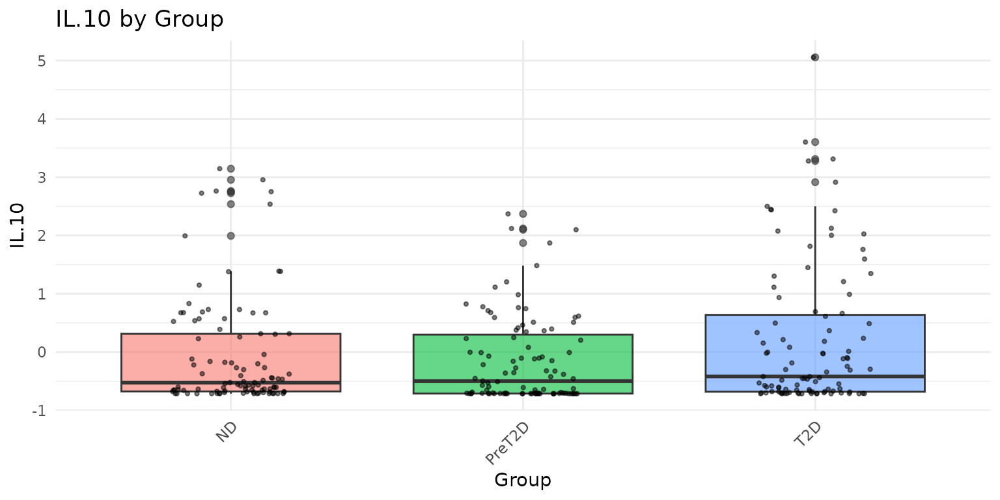
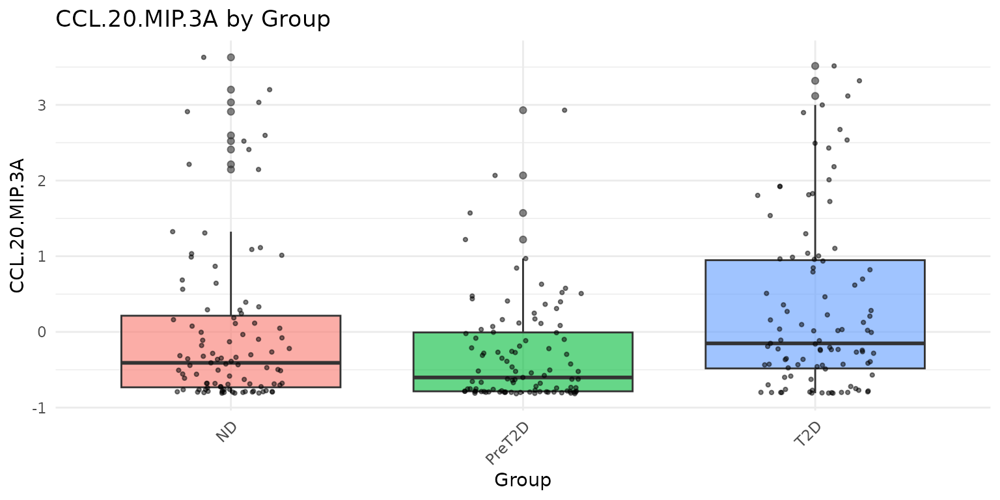
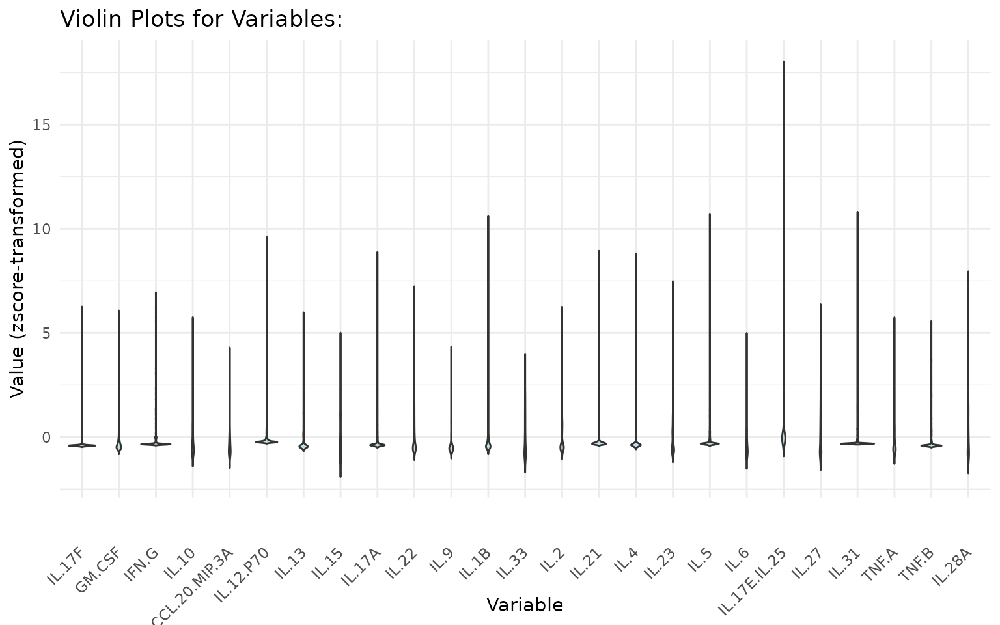
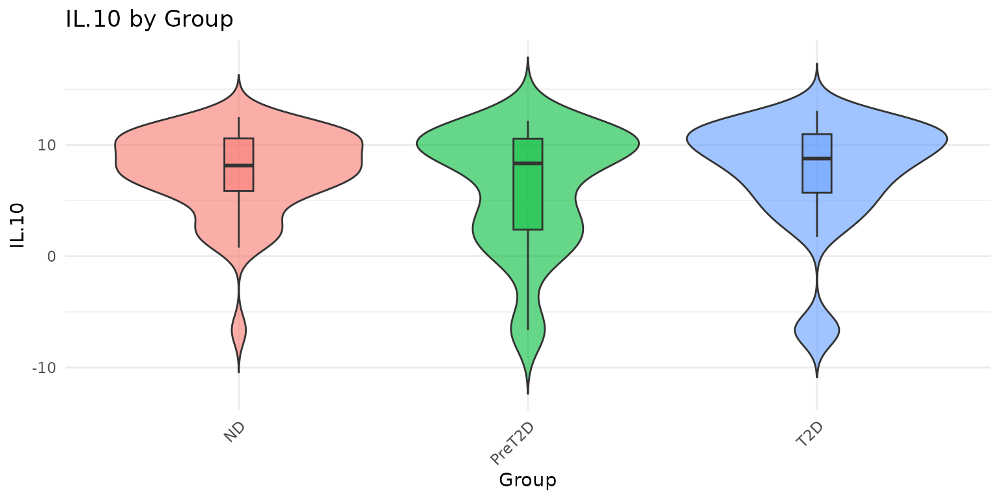
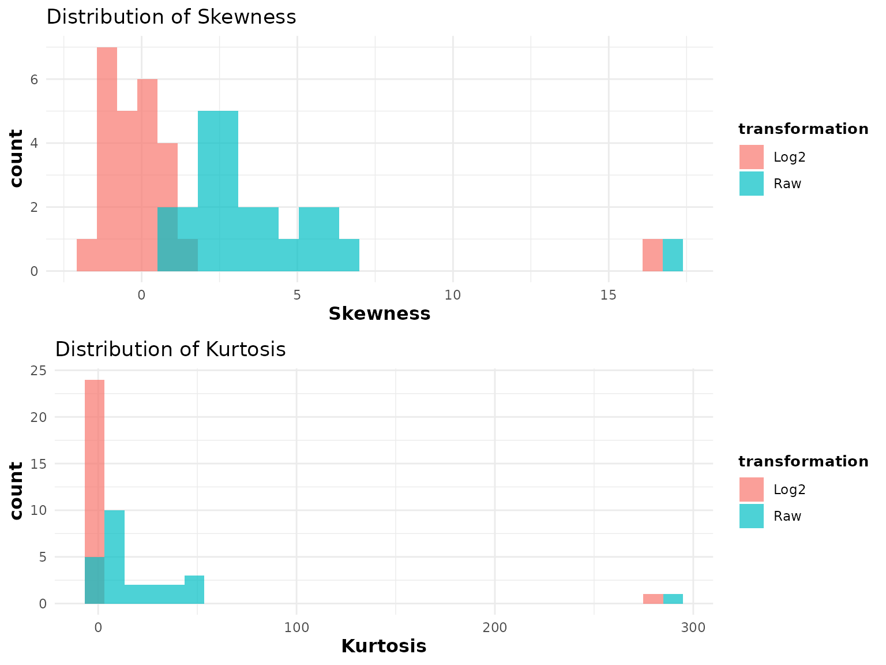
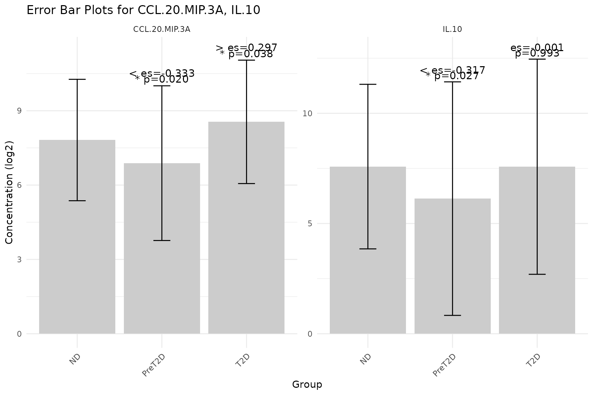
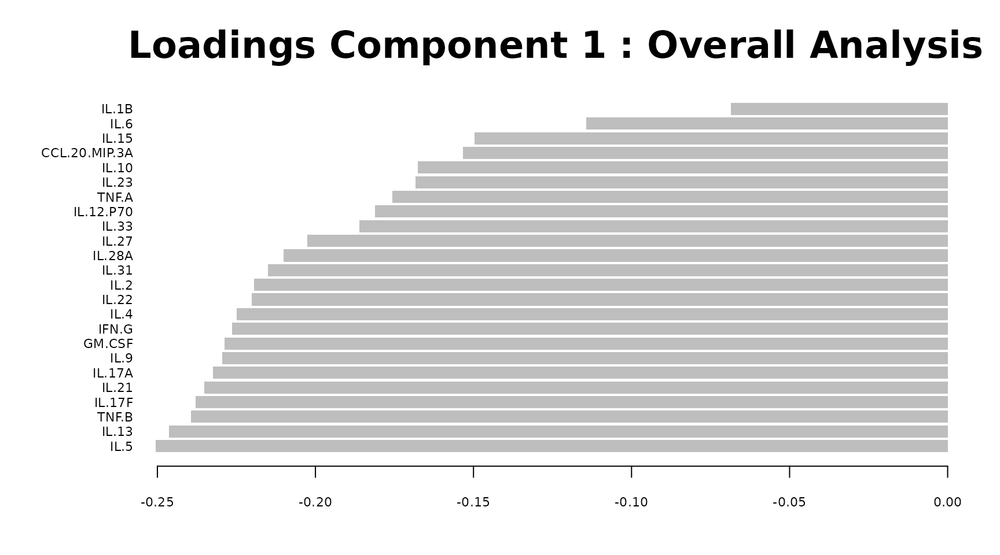
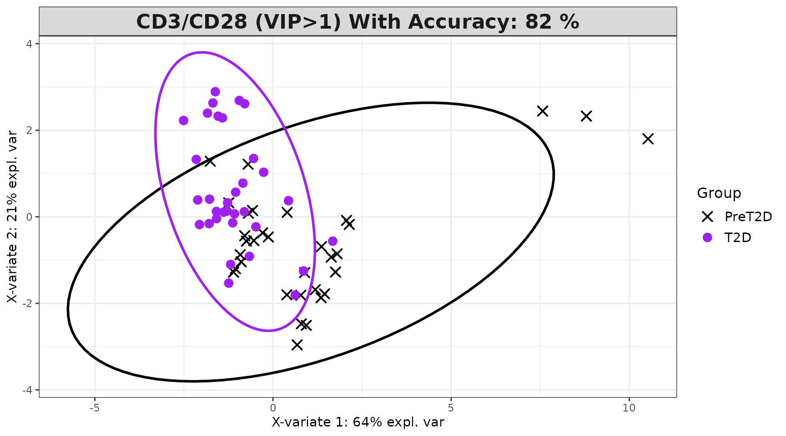
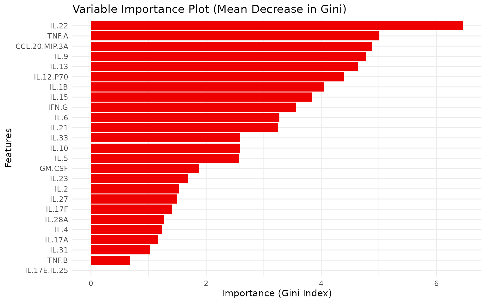

# Getting Started with CytoProfile

**CytoProfile** is an R package designed for end-to-end analysis and
visualization of cytokine profiling data from immunological and clinical
studies. It provides a structured workflow covering:

- Quality control and distributional assessment
- Exploratory visualization (boxplots, violin plots, error bar plots)
- Univariate statistical testing (t-test / Wilcoxon, ANOVA /
  Kruskal-Wallis)
- Multivariate methods (PCA, sPLS-DA, MINT sPLS-DA)
- Statistical visualizations (volcano plots, heatmaps, dual-flashlight
  plots)
- Machine learning classification (Random Forest, XGBoost)

This vignette provides a guided, step-by-step tutorial for each
function, including input data requirements, key parameters, and
guidance on interpreting outputs.

------------------------------------------------------------------------

## Installation and Dependencies

### Required Bioconductor package

CytoProfile depends on **mixOmics**, which must be installed from
Bioconductor before installing CytoProfile:

``` r
if (!requireNamespace("BiocManager", quietly = TRUE)) {
  install.packages("BiocManager")
}
BiocManager::install("mixOmics")
```

### Installing CytoProfile

``` r
# From CRAN (stable release)
install.packages("CytoProfile")

# From GitHub (development version)
# install.packages("devtools")
devtools::install_github("saraswatsh/CytoProfile", ref = "devel")
```

### Package loading

CytoProfile imports all necessary packages internally, you do **not**
need to call [`library()`](https://rdrr.io/r/base/library.html) for its
dependencies (e.g., `ggplot2`, `dplyr`, `mixOmics`). The only exception
in this vignette is `dplyr`, which is used explicitly for data
subsetting in the examples below and is not re-exported by CytoProfile.

``` r
library(CytoProfile)
library(dplyr)   # used only for filter() in the examples below
```

------------------------------------------------------------------------

## 1. Data Loading and Format Requirements

### Input data format

All CytoProfile functions expect a **data frame** (or coercible matrix)
where:

- **Cytokine columns** are numeric (concentrations or transformed
  values).
- **Grouping columns** (e.g., disease group, treatment) are character or
  factor.
- There are **no strict naming requirements**, but column names must be
  unique. The functions internally call
  [`make.names()`](https://rdrr.io/r/base/make.names.html) to sanitize
  names with special characters (e.g., `CCL-20/MIP-3A` becomes
  `CCL.20.MIP.3A`).
- Missing values (`NA`) are handled internally by most functions, but
  rows with all-missing cytokine values should be removed prior to
  analysis.

CytoProfile ships with five example datasets (`ExampleData1` through
`ExampleData5`). Throughout this vignette we use `ExampleData1`, which
contains 297 observations of 25 cytokines along with `Group`,
`Treatment`, and `Time` columns.

``` r
data("ExampleData1")
data_df <- ExampleData1

# Inspect structure
dim(data_df)
#> [1] 297  28
names(data_df)[1:6]
#> [1] "Group"     "Treatment" "Time"      "IL-17F"    "GM-CSF"    "IFN-G"
head(data_df[, 1:5])
#>   Group Treatment Time IL-17F GM-CSF
#> 1   T2D  CD3/CD28   20   3.31   7.16
#> 2   T2D  CD3/CD28   20   0.38   0.87
#> 3   T2D  CD3/CD28   20   1.25   2.47
#> 4   T2D  CD3/CD28   20   2.24   3.52
#> 5   T2D  CD3/CD28   20   0.25   1.58
#> 6   T2D  CD3/CD28   20   0.96   1.87
table(data_df$Group)
#> 
#>     ND PreT2D    T2D 
#>     99     99     99
table(data_df$Treatment)
#> 
#>     CD3/CD28          LPS Unstimulated 
#>           99           99           99
```

> **Recommended sample size:** Functions perform best with at least 10
> samples per group. Machine learning functions (Random Forest, XGBoost)
> require larger sample sizes ($\geq$ 20 per group) to produce reliable
> cross-validated performance estimates.

------------------------------------------------------------------------

## 2. Exploratory Data Analysis

### 2.1 Boxplots - `cyt_bp()`

**Purpose:** Generate boxplots for each numeric variable, optionally
grouped by one or more categorical variables.

**Key data requirements:** - At least one numeric column is required. -
If `group_by` is specified, those columns must be character or factor.

**Key parameters:**

| Parameter     | Description                                                            | Default  |
|---------------|------------------------------------------------------------------------|----------|
| `data`        | Data frame or matrix                                                   | \-       |
| `group_by`    | Column name(s) for grouping                                            | `NULL`   |
| `scale`       | Transformation: `"none"`, `"log2"`, `"log10"`, `"zscore"`, `"custom"`  | `"none"` |
| `bin_size`    | Max plots per page (ungrouped only)                                    | `25`     |
| `y_lim`       | y-axis limits, e.g. `c(0, 20)`                                         | `NULL`   |
| `output_file` | File path to save (e.g. `"plots.pdf"`). `NULL` displays interactively. | `NULL`   |

**When to use which `scale`:** - `"log2"` or `"log10"`: when cytokine
concentrations span several orders of magnitude or show strong
right-skew (common for raw immunoassay data). - `"zscore"`: when
comparing distributions on a standardized scale across cytokines with
very different concentration ranges. - `"none"`: when data are already
transformed.

**Interpreting the output:** - Each boxplot shows the median (horizontal
line), interquartile range (box), 1.5x IQR whiskers, and individual data
points (jittered). - Overlapping distributions between groups suggest no
strong group effect for that cytokine. - Outliers far beyond the
whiskers warrant attention - consider whether they represent biological
extremes or measurement artefacts.

``` r
# Ungrouped boxplots with log2 transformation
# All numeric columns are plotted; up to bin_size = 25 per page
cyt_bp(data_df[, -c(1:3)], output_file = NULL, scale = "log2")
```


``` r
# Grouped boxplots: one plot per cytokine, coloured by Group
# Only passing Group and two cytokines for a concise display
cyt_bp(
  data_df[, c("Group", "IL-10", "CCL-20/MIP-3A")],
  group_by = "Group",
  scale = "zscore"
)
```



> **Note:**
> [`cyt_bp()`](https://cytoprofile.cytokineprofile.org/dev/reference/cyt_bp.md)
> invisibly returns a named list of `ggplot` objects, so you can
> retrieve and further modify any individual plot:
> `plots <- cyt_bp(...); plots[["IL-10"]] + ggplot2::ggtitle("Custom title")`.

------------------------------------------------------------------------

### 2.2 Violin Plots - `cyt_violin()`

**Purpose:** Similar to
[`cyt_bp()`](https://cytoprofile.cytokineprofile.org/dev/reference/cyt_bp.md)
but shows the full data distribution shape using kernel density
estimation, making it especially informative for bimodal or asymmetric
cytokine distributions.

**Key parameters** (same as
[`cyt_bp()`](https://cytoprofile.cytokineprofile.org/dev/reference/cyt_bp.md),
plus):

| Parameter         | Description                                                     | Default |
|-------------------|-----------------------------------------------------------------|---------|
| `boxplot_overlay` | Draw a narrow boxplot inside each violin to show median and IQR | `FALSE` |

**Interpreting the output:** - A wide violin belly indicates many
observations at that value. - Bimodal violins (two wide regions) suggest
subpopulations within a group - worth investigating with further
stratification. - Setting `boxplot_overlay = TRUE` combines density
estimation with quartile summaries in one panel.

``` r
# Ungrouped violin plots with z-score scaling
cyt_violin(data_df[, -c(1:3)], output_file = NULL, scale = "zscore")
```



``` r
# Grouped violin plots with boxplot overlay and log2 scaling
cyt_violin(
  data_df[, c("Group", "IL-10", "CCL-20/MIP-3A")],
  group_by = "Group",
  boxplot_overlay = TRUE,
  scale = "log2"
)
```



------------------------------------------------------------------------

### 2.3 Skewness and Kurtosis - `cyt_skku()`

**Purpose:** Assess whether cytokine distributions are symmetric
(skewness $\approx$ 0) and whether they have tails heavier than a normal
distribution (kurtosis \> 0). This is important for deciding whether a
log or other transformation is appropriate before statistical testing.

**Key data requirements:** - Numeric measurement columns only (exclude
grouping columns via `group_cols`). - All values should be positive if
log2 transformation will be applied downstream, since
[`cyt_skku()`](https://cytoprofile.cytokineprofile.org/dev/reference/cyt_skku.md)
uses log2 internally for comparison.

**Key parameters:**

| Parameter       | Description                                    | Default |
|-----------------|------------------------------------------------|---------|
| `group_cols`    | Character vector of grouping column names      | `NULL`  |
| `print_res_raw` | Return summary stats for raw data              | `FALSE` |
| `print_res_log` | Return summary stats for log2-transformed data | `FALSE` |
| `output_file`   | File path to save plots                        | `NULL`  |

**Interpreting the output:** - Two histograms are produced: one for
skewness, one for kurtosis, comparing raw data (red) and
log2-transformed data (blue). - **Skewness:** Values far from 0 indicate
asymmetry. Positive skewness (right tail) is common in raw cytokine
data. After log2 transformation, distributions closer to 0 indicate
better symmetry. - **Kurtosis:** Positive excess kurtosis indicates
heavier-than-normal tails (more outliers expected). After log2
transformation, kurtosis values closer to 0 suggest the transformation
improved normality. - If log2 transformation substantially reduces both
skewness and kurtosis compared to raw values, it is recommended as a
pre-processing step.

``` r
# Overall distributional assessment (no grouping)
cyt_skku(data_df[, -c(1:3)], output_file = NULL, group_cols = NULL)
```



``` r
# Grouped assessment by "Group"
cyt_skku(data_df[, -c(2:3)], output_file = NULL, group_cols = c("Group"))
```


------------------------------------------------------------------------

### 2.4 Error Bar Plots - `cyt_errbp()`

**Purpose:** Visualize the central tendency and spread of each cytokine
across groups, with optional statistical annotations (p-values and
effect sizes) comparing each group to the first (baseline) group.

**Key data requirements:** - At least one numeric column and one
grouping column. - The first factor level of `group_col` is used as the
baseline for comparisons.

**Key parameters:**

| Parameter         | Description                                                                                             | Default  |
|-------------------|---------------------------------------------------------------------------------------------------------|----------|
| `group_col`       | Name of the grouping column                                                                             | \-       |
| `stat`            | Central tendency: `"mean"` or `"median"`                                                                | `"mean"` |
| `error`           | Spread: `"se"` (standard error), `"sd"`, `"mad"`, `"ci"` (95% CI)                                       | `"se"`   |
| `scale`           | Data transformation (see [`cyt_bp()`](https://cytoprofile.cytokineprofile.org/dev/reference/cyt_bp.md)) | `"none"` |
| `method`          | Statistical test: `"auto"`, `"ttest"`, `"wilcox"`                                                       | `"auto"` |
| `p_lab`           | Show p-value annotations                                                                                | `TRUE`   |
| `es_lab`          | Show effect size annotations                                                                            | `TRUE`   |
| `class_symbol`    | Use symbols (`*`, `>>`) rather than numeric values                                                      | `FALSE`  |
| `p_adjust_method` | p-value correction method (e.g. `"BH"`)                                                                 | `NULL`   |
| `output_file`     | File path to save                                                                                       | `NULL`   |

**Interpreting the output:** - Each facet panel corresponds to one
cytokine. Bars show the central tendency; error bars show spread. -
P-value labels above bars indicate statistical significance versus the
baseline group. Values $\leq$ 0.05 are conventionally significant. -
Effect size labels indicate the practical magnitude of the difference:
larger absolute values denote greater differences. For t-test
comparisons, this is Cohen’s d; for Wilcoxon, the rank-biserial
correlation. - `class_symbol = TRUE` renders significance as stars (`*`
to `*****`) and effect size as arrows (`>` to `>>>>>`), following
conventions used in the accompanying publication.

``` r
# Basic error bar plot: default mean +/- SE
df_err <- ExampleData1[, c("Group", "CCL-20/MIP-3A", "IL-10")]
cyt_errbp(
  df_err,
  group_col = "Group",
  x_lab = "Group",
  y_lab = "Concentration"
)
```


``` r
# Mean +/- SD with log2 transformation, symbols, and t-test
cyt_errbp(
  df_err,
  group_col = "Group",
  stat = "mean",
  error = "sd",
  scale = "log2",
  class_symbol = TRUE,
  method = "ttest",
  x_lab = "Group",
  y_lab = "Concentration (log2)"
)
```



> **Tip:** Use `p_adjust_method = "BH"` when analysing a large cytokine
> panel to control the false discovery rate across multiple comparisons.

------------------------------------------------------------------------

## 3. Univariate Analysis

### 3.1 Two-group comparisons - `cyt_univariate()`

**Purpose:** Perform pairwise statistical tests between exactly two
groups for each numeric cytokine column. For each categorical predictor
with exactly two levels, either a Student’s t-test or Wilcoxon rank-sum
test is applied to each numeric outcome.

**Key data requirements:** - At least one factor/character column with
**exactly two** levels. - At least one numeric column. - Both groups
must have $\geq$ 2 observations with non-zero variance.

**Automatic test selection (`method = "auto"`):** When
`method = "auto"`, a Shapiro-Wilk normality test is applied to the
pooled values for each cytokine within a comparison. If both groups pass
normality (p \> 0.05), a t-test is used; otherwise, the Wilcoxon
rank-sum (Mann-Whitney U) test is used. This selection is done
independently for each cytokine. If you prefer a consistent approach,
set `method = "ttest"` or `method = "wilcox"` explicitly.

**Key parameters:**

| Parameter         | Description                                                          | Default  |
|-------------------|----------------------------------------------------------------------|----------|
| `scale`           | Transformation applied before testing                                | `NULL`   |
| `method`          | `"auto"`, `"ttest"`, or `"wilcox"`                                   | `"auto"` |
| `format_output`   | Return as tidy data frame (`TRUE`) or list of test objects (`FALSE`) | `FALSE`  |
| `p_adjust_method` | Multiple testing correction (e.g. `"BH"`)                            | `NULL`   |

**Interpreting the output:** - With `format_output = TRUE`, a data frame
is returned with columns: `Outcome` (cytokine), `Categorical` (grouping
variable), `Comparison` (group A vs group B), `Test` (method used),
`Estimate`, `Statistic`, and `P_value`. - P-values \< 0.05 indicate a
statistically significant difference between groups for that cytokine. -
When testing many cytokines simultaneously, use `p_adjust_method = "BH"`
to control the false discovery rate; the adjusted column `P_adj` will be
appended.

``` r
data_uni <- ExampleData1[, -c(3)]
data_uni <- dplyr::filter(data_uni, Group != "ND", Treatment != "Unstimulated")

# Tidy output with log2 transformation and automatic test selection
cyt_univariate(
  data_uni[, c("Group", "Treatment", "IL-10", "CCL-20/MIP-3A")],
  scale    = "log2",
  method   = "auto",
  format_output = TRUE,
  p_adjust_method = "BH"
)
#>         Outcome Categorical      Comparison
#> 1         IL.10       Group   PreT2D vs T2D
#> 2 CCL.20.MIP.3A       Group   PreT2D vs T2D
#> 3         IL.10   Treatment CD3/CD28 vs LPS
#> 4 CCL.20.MIP.3A   Treatment CD3/CD28 vs LPS
#>                                                Test Estimate Statistic P_value
#> 1 Wilcoxon rank sum test with continuity correction   -0.956    1625.0   0.012
#> 2 Wilcoxon rank sum test with continuity correction   -1.575    1050.5   0.000
#> 3 Wilcoxon rank sum test with continuity correction    1.690    3091.0   0.000
#> 4 Wilcoxon rank sum test with continuity correction    0.488    2509.5   0.132
#>   P_adj
#> 1 0.016
#> 2 0.000
#> 3 0.000
#> 4 0.132
```

------------------------------------------------------------------------

### 3.2 Multi-group comparisons - `cyt_univariate_multi()`

**Purpose:** Extend univariate testing to categorical predictors with
**more than two** levels using either ANOVA (parametric) or
Kruskal-Wallis (non-parametric) global tests, followed by pairwise
post-hoc comparisons.

**Key data requirements:** - At least one factor/character column with
**more than two** levels. - At least one numeric column. - ANOVA is
restricted to predictors with $\leq$ 10 levels.

**Key parameters:**

| Parameter         | Description                                                       | Default              |
|-------------------|-------------------------------------------------------------------|----------------------|
| `method`          | `"anova"` (Tukey HSD post-hoc) or `"kruskal"` (pairwise Wilcoxon) | `"anova"`            |
| `cat_vars`        | Character vector of categorical column names to test              | `NULL` (auto-detect) |
| `cont_vars`       | Character vector of numeric column names to test                  | `NULL` (auto-detect) |
| `p_adjust_method` | Correction method for pairwise p-values                           | `"BH"`               |
| `format_output`   | Return as tidy data frame                                         | `FALSE`              |

**Interpreting the output:** - With `format_output = TRUE`, a data frame
with columns `Outcome`, `Categorical`, `Comparison`, and `P_adj` is
returned. - Each row represents one pairwise comparison for one
cytokine. `P_adj` values \< 0.05 indicate significant pairwise
differences after multiple testing correction. - Use
`method = "kruskal"` when cytokine data are non-normal or when sample
sizes are small.

``` r
# Kruskal-Wallis with pairwise Wilcoxon for multi-group comparison
cyt_univariate_multi(
  ExampleData1[, c("Group", "IL-10", "CCL-20/MIP-3A")],
  method = "kruskal",
  format_output = TRUE
)
#>         Outcome Categorical Comparison  P_adj
#> 1         IL.10       Group  PreT2D-ND 0.2995
#> 2         IL.10       Group     T2D-ND 0.3181
#> 3         IL.10       Group T2D-PreT2D 0.0849
#> 4 CCL.20.MIP.3A       Group  PreT2D-ND 0.0518
#> 5 CCL.20.MIP.3A       Group     T2D-ND 0.0332
#> 6 CCL.20.MIP.3A       Group T2D-PreT2D 0.0001
```

------------------------------------------------------------------------

## 4. Statistical Visualizations

### 4.1 Volcano Plot - `cyt_volc()`

**Purpose:** Visualize fold change versus statistical significance for
all cytokines between two groups simultaneously, highlighting cytokines
that are both biologically meaningful (large fold change) and
statistically significant.

**Key data requirements:** - One grouping column and multiple numeric
columns. - Both conditions specified must exist as levels of
`group_col`.

**Key parameters:**

| Parameter            | Description                            | Default               |
|----------------------|----------------------------------------|-----------------------|
| `group_col`          | Grouping column name                   | \-                    |
| `cond1`, `cond2`     | The two conditions to compare          | `NULL` (all pairwise) |
| `fold_change_thresh` | Fold change threshold (original scale) | `2`                   |
| `p_value_thresh`     | p-value significance threshold         | `0.05`                |
| `top_labels`         | Number of top cytokines to label       | `10`                  |
| `method`             | `"ttest"` or `"wilcox"`                | `"ttest"`             |
| `p_adjust_method`    | Multiple testing correction            | `NULL`                |
| `add_effect`         | Compute and return effect sizes        | `FALSE`               |

**Interpreting the output:** - **x-axis:** log2 fold change (cond2 /
cond1). Positive values indicate higher expression in `cond2`; negative
values in `cond1`. - **y-axis:** -log10(p-value). Higher values = more
significant. - **Dashed lines:** Vertical lines mark the +/-log2 fold
change threshold; the horizontal line marks the -log10 p-value
threshold. - **Red points:** Cytokines exceeding both thresholds - these
are the candidates most likely to be biologically relevant between the
two conditions. - **Labels:** The `top_labels` cytokines with the most
significant p-values are labelled.

``` r
data_volc <- ExampleData1[, -c(2:3)]

volc_plots <- cyt_volc(
  data_volc,
  group_col = "Group",
  cond1 = "T2D",
  cond2 = "ND",
  fold_change_thresh = 2.0,
  p_value_thresh = 0.05,
  top_labels = 15,
  method = "ttest"
)

# The function returns a named list of ggplot objects; print the comparison
volc_plots[["T2D vs ND"]]
```


------------------------------------------------------------------------

### 4.2 Heatmap - `cyt_heatmap()`

**Purpose:** Visualize the expression matrix of all cytokines across all
samples, with optional annotation and hierarchical clustering to reveal
sample groupings and cytokine co-expression patterns.

**Key data requirements:** - A data frame containing numeric cytokine
columns. Non-numeric columns are ignored. - The annotation column (if
used) must have length equal to the number of rows in the numeric
matrix.

**Key parameters:**

| Parameter         | Description                                                                     | Default  |
|-------------------|---------------------------------------------------------------------------------|----------|
| `scale`           | Transformation: `"log2"`, `"log10"`, `"row_zscore"`, `"col_zscore"`, `"zscore"` | `NULL`   |
| `annotation_col`  | Column name or vector for row/column annotation                                 | `NULL`   |
| `annotation_side` | `"auto"`, `"row"`, or `"col"`                                                   | `"auto"` |
| `show_row_names`  | Show sample row labels                                                          | `FALSE`  |
| `show_col_names`  | Show cytokine column labels                                                     | `TRUE`   |
| `cluster_rows`    | Cluster samples (rows)                                                          | `TRUE`   |
| `cluster_cols`    | Cluster cytokines (columns)                                                     | `TRUE`   |
| `title`           | Plot title, or a file path ending in `.pdf`/`.png` to save                      | `NULL`   |

**Interpreting the output:** - The colour scale represents cytokine
expression after any transformation: blue = low, white = mid, red =
high. - Row dendrogram (left) clusters samples by their cytokine
expression profiles. Samples that cluster together share similar
cytokine signatures. - Column dendrogram (top) clusters cytokines by
co-expression. Cytokines close together in the column dendrogram are
correlated across samples. - The annotation sidebar (if provided)
colour-codes samples by group, making it easy to see whether cluster
structure aligns with biological groupings. - Hiding row names
(`show_row_names = FALSE`) is recommended when there are many samples,
as individual sample labels become unreadable and clutter the plot.

``` r
cyt_heatmap(
  data = data_df[, -c(2:3)],
  scale = "log2",
  annotation_col = "Group",
  annotation_side = "auto",
  show_row_names = FALSE,
  title = NULL
)
```


------------------------------------------------------------------------

### 4.3 Dual-Flashlight Plot - `cyt_dualflashplot()`

**Purpose:** Simultaneously visualize effect size (SSMD - Strictly
Standardized Mean Difference) and fold change for all cytokines between
two groups. The dual-flashlight plot is particularly valuable for
identifying cytokines with both a large effect size and substantial fold
change, which are strong candidates for further investigation as
biomarkers.

**Why SSMD instead of p-values?** Traditional p-values conflate effect
size with sample size: a very large study can yield significant p-values
for biologically trivial differences. SSMD quantifies effect size
independently of sample size, making it suitable for prioritizing
cytokines in panels of varying sizes.

**Key data requirements:** - A data frame with numeric cytokine columns
and one grouping column. - `group1` and `group2` must be levels present
in `group_var`.

**Key parameters:**

| Parameter          | Description                             | Default |
|--------------------|-----------------------------------------|---------|
| `group_var`        | Grouping column name                    | \-      |
| `group1`, `group2` | The two conditions to compare           | \-      |
| `ssmd_thresh`      | SSMD threshold for marking significance | `1`     |
| `log2fc_thresh`    | log2 fold change threshold              | `1`     |
| `top_labels`       | Number of cytokines with largest        | SSMD    |
| `verbose`          | Print the underlying statistics table   | `FALSE` |

**Interpreting the output:** - **x-axis:** Average log2 fold change.
Positive = higher in `group1`. - **y-axis:** SSMD. \|SSMD\| $\geq$ 1 =
strong effect; \|SSMD\| $\geq$ 0.5 = moderate. - **Point colour:**
Effect strength category (strong = red, moderate = orange, weak =
blue). - **Point shape:** Triangles indicate cytokines that exceed both
the SSMD and log2FC thresholds simultaneously - these are the most
compelling candidates. - **Dashed lines:** Mark the defined
thresholds. - Cytokines in the upper-right and lower-left quadrants
beyond the dashed lines are elevated in `group1` or `group2`
respectively, with strong effect and substantial fold change.

``` r
data_dfp <- ExampleData1[, -c(2:3)]

dfp <- cyt_dualflashplot(
  data_dfp,
  group_var    = "Group",
  group1       = "T2D",
  group2       = "ND",
  ssmd_thresh  = 0.2,
  log2fc_thresh = 1,
  top_labels   = 10,
  verbose      = FALSE
)
dfp
```


``` r
# Inspect the underlying statistics
head(dfp$data[order(abs(dfp$data$ssmd), decreasing = TRUE), ], 10)
#> # A tibble: 10 × 11
#>    cytokine        mean_ND mean_PreT2D   mean_T2D variance_ND variance_PreT2D
#>    <chr>             <dbl>       <dbl>      <dbl>       <dbl>           <dbl>
#>  1 IL.6          4620.       5197.      8925.         2.86e+7         5.72e+7
#>  2 IL.27            0.0662      0.0834     0.106      6.18e-3         5.66e-3
#>  3 IL.12.P70       13.0        39.1       78.9        4.15e+2         2.56e+4
#>  4 IL.23            0.147       0.243      0.269      3.13e-2         9.37e-2
#>  5 CCL.20.MIP.3A  634.        404.       887.         6.72e+5         2.74e+5
#>  6 IL.2          9227.      10718.     16129.         2.60e+8         4.10e+8
#>  7 IL.17F           1.63        2.35       3.11       1.56e+1         3.37e+1
#>  8 IL.10          979.        836.      1366.         1.99e+6         1.19e+6
#>  9 IL.28A           0.0537      0.0710     0.0666     2.45e-3         5.10e-3
#> 10 IL.17A         352.        653.       615.         9.40e+5         2.88e+6
#> # ℹ 5 more variables: variance_T2D <dbl>, ssmd <dbl>, log2FC <dbl>,
#> #   Effect <fct>, Significant <lgl>
```

------------------------------------------------------------------------

## 5. Multivariate Analysis

### 5.1 Principal Component Analysis - `cyt_pca()`

**Purpose:** Reduce the dimensionality of the cytokine data and
visualize sample-level variation across groups. PCA identifies the axes
(principal components) of greatest variance in the data without using
group labels, making it an unsupervised method suitable for initial
exploration.

**Key data requirements:** - At least one grouping column and multiple
numeric cytokine columns. - A sufficient number of observations relative
to the number of cytokines is recommended (at least n \> p, ideally n \>
3p).

**Key parameters:**

| Parameter     | Description                                      | Default       |
|---------------|--------------------------------------------------|---------------|
| `group_col`   | Primary grouping column                          | \-            |
| `group_col2`  | Second grouping column (stratifies analysis)     | `NULL`        |
| `colors`      | Vector of colours for groups                     | `NULL` (auto) |
| `pch_values`  | Vector of point shapes, one per group level      | **required**  |
| `comp_num`    | Number of principal components to compute        | `2`           |
| `ellipse`     | Draw 95% confidence ellipses per group           | `FALSE`       |
| `scale`       | Data transformation                              | `"none"`      |
| `style`       | Set to `"3D"` for a 3D scatter if `comp_num = 3` | `NULL`        |
| `output_file` | File path to save all plots                      | \-            |

**Interpreting the output:** - **Individuals plot:** Each point is one
sample. Points close together have similar cytokine profiles. Clear
separation between coloured groups suggests a discriminating cytokine
signature exists. - **Scree plot:** Shows the percentage of variance
explained by each component (individual, blue) and cumulatively (dashed
green). Choose the number of components that capture $\geq$ 70-80% of
variance. - **Loadings plot:** Shows which cytokines contribute most to
each component. Long bars = large contribution. The sign indicates
direction (positive loading = higher values push samples in the positive
direction along that component). - **Biplot:** Overlays sample scores
and cytokine loadings. Cytokine arrows pointing toward a group cluster
indicate those cytokines are elevated in that group. - **Correlation
circle:** Cytokines near the edge of the circle are well represented by
the selected two components. Cytokines close together are positively
correlated; those opposite are negatively correlated.

``` r
data_pca <- ExampleData1[, -c(3, 23)]
data_pca <- dplyr::filter(data_pca, Group != "ND" & Treatment != "Unstimulated")

pca_results <- cyt_pca(
  data_pca,
  output_file  = NULL,
  colors       = c("black", "red2"),
  scale        = "log2",
  comp_num     = 2,
  pch_values   = c(16, 4),
  group_col    = "Group",
  ellipse      = TRUE
)
```

``` r
pca_results$overall_indiv_plot
pca_results$scree_plot
```


``` r
pca_results$loadings$Comp1()
pca_results$correlation_circle()
```



------------------------------------------------------------------------

### 5.2 Sparse PLS-DA - `cyt_splsda()`

**Purpose:** A supervised multivariate method that finds linear
combinations of cytokines that maximally discriminate between groups,
while simultaneously selecting the most discriminating cytokines
(sparsity). Unlike PCA, sPLS-DA uses group labels to guide the component
construction.

**Key data requirements:** - At least two groups in `group_col`. -
Multiple numeric cytokine columns. - For reliable cross-validation,
$\geq$ 10 samples per group is recommended.

**Key parameters:**

| Parameter    | Description                                               | Default      |
|--------------|-----------------------------------------------------------|--------------|
| `group_col`  | Primary grouping column                                   | \-           |
| `group_col2` | Treatment/stratification column (runs analysis per level) | `NULL`       |
| `var_num`    | Number of cytokines selected per component                | **required** |
| `comp_num`   | Number of components                                      | `2`          |
| `pch_values` | Point shapes, one per group                               | **required** |
| `cv_opt`     | Cross-validation: `"loocv"` or `"Mfold"`                  | `NULL`       |
| `fold_num`   | Number of folds for Mfold CV                              | `5`          |
| `tune`       | Auto-tune `var_num` and `comp_num` via CV                 | `FALSE`      |
| `ellipse`    | Draw 95% confidence ellipses                              | `FALSE`      |
| `bg`         | Draw prediction background                                | `FALSE`      |
| `roc`        | Plot ROC curves                                           | `FALSE`      |
| `scale`      | Data transformation                                       | `"none"`     |

**Interpreting the output:** - **Classification plot (individuals
plot):** Labelled with accuracy (% training samples correctly
classified). Clear separation indicates the model successfully
identified a discriminating cytokine signature. - **Loadings plot:**
Shows which cytokines load most strongly on each component and in which
group they are elevated (colour of the bar). The `contrib = "max"`
setting colours each bar by the group with the highest mean for that
cytokine. - **VIP scores plot:** Variable Importance in Projection
scores for each component. Cytokines with VIP \> 1 are considered
important discriminators and are used to fit a refined model. - **VIP \>
1 classification plot:** A second model fitted using only VIP \> 1
cytokines. Comparing accuracy between the full and VIP-filtered model
shows whether the signature can be simplified. - **Cross-validation
error plot** (if `cv_opt` is set): Error rate across components. The
optimal number of components is where the error rate plateaus or reaches
its minimum.

``` r
data_spls <- ExampleData1[, -c(3)]
data_spls <- dplyr::filter(data_spls, Group != "ND" & Treatment == "CD3/CD28")

spls_results <- cyt_splsda(
  data_spls,
  output_file  = NULL,
  colors       = c("black", "purple"),
  scale        = "log2",
  ellipse      = TRUE,
  var_num      = 25,
  cv_opt       = "loocv",
  comp_num     = 2,
  pch_values   = c(16, 4),
  group_col    = "Group",
  group_col2   = "Treatment",
  roc          = FALSE,
  verbose      = FALSE
)
```

``` r
spls_results$overall_indiv_plot
spls_results$vip_indiv_plot
```



``` r
spls_results$loadings$Comp1()
spls_results$vip_scores$Comp1()
```


------------------------------------------------------------------------

### 5.3 MINT sPLS-DA - `cyt_mint_splsda()`

**Purpose:** An extension of sPLS-DA for datasets collected across
multiple batches or studies. MINT (Multivariate INTegration) models a
global biological signal while accounting for batch-specific variation,
making it appropriate when data cannot be combined directly due to
technical differences between collection sites or time points.

**Key data requirements:** - Same as
[`cyt_splsda()`](https://cytoprofile.cytokineprofile.org/dev/reference/cyt_splsda.md),
plus a `batch_col` column identifying which batch/study each sample
belongs to. - At least two batches are required; each batch should
contain samples from all groups if possible.

**Key parameters:** Same as
[`cyt_splsda()`](https://cytoprofile.cytokineprofile.org/dev/reference/cyt_splsda.md),
plus:

| Parameter   | Description                               | Default      |
|-------------|-------------------------------------------|--------------|
| `batch_col` | Column identifying batch/study membership | **required** |

**Interpreting the output:** - Identical to
[`cyt_splsda()`](https://cytoprofile.cytokineprofile.org/dev/reference/cyt_splsda.md)
outputs, with the addition of **partial plots** (one per batch), which
show how well the global model fits within each individual batch. - The
global individuals plot should show separation between groups even when
batch effects are present - if groups overlap only in the global plot
but separate in partial plots, the batch effect is dominating the
signal.

``` r
data_mint <- ExampleData5[, -c(2, 4)]
data_mint <- dplyr::filter(data_mint, Group != "ND")

mint_results <- cyt_mint_splsda(
  data_mint,
  group_col  = "Group",
  batch_col  = "Batch",
  colors     = c("black", "purple"),
  ellipse    = TRUE,
  var_num    = 25,
  comp_num   = 2,
  scale      = "log2",
  verbose    = FALSE
)
```

``` r
mint_results$global_indiv_plot
mint_results$partial_indiv_plot
```


``` r
mint_results$global_loadings_plots$Comp1()
```


------------------------------------------------------------------------

## 6. Machine Learning Models

> **Recommended sample size:** For reliable performance estimates,
> machine learning methods require larger datasets. A minimum of 20
> samples per class is recommended; cross-validation estimates become
> stable with $\geq$ 50 samples per class.

### 6.1 XGBoost Classification - `cyt_xgb()`

**Purpose:** Train a gradient-boosted tree classifier on cytokine data
for multi-class or binary group classification. XGBoost is well suited
to high-dimensional cytokine panels and provides feature importance as a
by-product.

**Key data requirements:** - One grouping column (the outcome) and
multiple numeric cytokine predictors. - Grouping column will be encoded
to numeric labels internally (0-indexed).

**Key parameters:**

| Parameter        | Description                                              | Default            |
|------------------|----------------------------------------------------------|--------------------|
| `group_col`      | Outcome column name                                      | \-                 |
| `train_fraction` | Proportion used for training                             | `0.7`              |
| `nrounds`        | Number of boosting rounds                                | `500`              |
| `max_depth`      | Maximum tree depth                                       | `6`                |
| `learning_rate`  | Step size shrinkage                                      | `0.1`              |
| `cv`             | Run k-fold cross-validation                              | `FALSE`            |
| `nfold`          | Number of CV folds                                       | `5`                |
| `objective`      | Loss function: `"multi:softprob"` or `"binary:logistic"` | `"multi:softprob"` |
| `eval_metric`    | Evaluation metric during training                        | `"mlogloss"`       |
| `plot_roc`       | Plot ROC curve (binary only)                             | `FALSE`            |
| `top_n_features` | Number of features shown in importance plot              | `10`               |
| `scale`          | Data transformation                                      | `"none"`           |

**Note on `Ckmeans.1d.dp`:** The `xgb.ggplot.importance()` function
optionally uses the `Ckmeans.1d.dp` package for a clustered importance
plot. If this package is not installed,
[`cyt_xgb()`](https://cytoprofile.cytokineprofile.org/dev/reference/cyt_xgb.md)
will automatically fall back to a standard bar chart. Install it with
`install.packages("Ckmeans.1d.dp")` for the enhanced plot.

**Interpreting the output:** - **Confusion matrix:** Rows = actual
classes; columns = predicted classes. The diagonal shows correct
classifications. Off-diagonal values are misclassifications. - **Feature
importance plot:** Shows the top `top_n_features` cytokines ranked by
Gain (the improvement in the loss function attributable to each
feature). Cytokines with higher Gain are more important for
classification. - **Cross-validation accuracy** (if `cv = TRUE`):
Provides an estimate of out-of-sample performance less susceptible to
overfitting than training accuracy alone. - **ROC curve** (binary only):
Area Under the Curve (AUC) summarizes classifier performance across all
thresholds. AUC = 1 is perfect; AUC = 0.5 is no better than chance.

``` r
data_ml <- data.frame(ExampleData1[, 1:3], log2(ExampleData1[, -c(1:3)]))
data_ml <- data_ml[, -c(2:3)]
data_ml <- dplyr::filter(data_ml, Group != "ND")

cyt_xgb(
  data          = data_ml,
  group_col     = "Group",
  nrounds       = 250,
  max_depth     = 4,
  learning_rate = 0.05,
  nfold         = 5,
  cv            = FALSE,
  objective     = "multi:softprob",
  eval_metric   = "mlogloss",
  top_n_features = 10,
  verbose       = 0,
  plot_roc      = FALSE,
  print_results = FALSE,
  seed          = 123
)
```


------------------------------------------------------------------------

### 6.2 Random Forest Classification - `cyt_rf()`

**Purpose:** Train a random forest ensemble classifier on cytokine data.
Random forests are robust to outliers and correlated predictors, and
naturally provide variable importance through the mean decrease in Gini
impurity.

**Key parameters:**

| Parameter        | Description                                | Default  |
|------------------|--------------------------------------------|----------|
| `group_col`      | Outcome column name                        | \-       |
| `ntree`          | Number of trees                            | `500`    |
| `mtry`           | Variables tried at each split              | `5`      |
| `train_fraction` | Training proportion                        | `0.7`    |
| `run_rfcv`       | Run cross-validation for feature selection | `TRUE`   |
| `k_folds`        | Folds for `rfcv`                           | `5`      |
| `plot_roc`       | Plot ROC curve (binary only)               | `FALSE`  |
| `cv`             | Run caret k-fold CV                        | `FALSE`  |
| `scale`          | Data transformation                        | `"none"` |
| `verbose`        | Print performance metrics                  | `FALSE`  |

**Interpreting the output:** - **Variable importance plot:** Cytokines
ordered by Mean Decrease in Gini. Higher values indicate greater
discrimination ability. This complements sPLS-DA loadings as a
non-linear importance measure. - **Cross-validation error curve** (if
`run_rfcv = TRUE`): Error rate versus number of variables. The elbow of
this curve (where error stabilizes) suggests the minimum number of
cytokines needed for good classification. This is useful for building
parsimonious panels. - **ROC curve** (binary only): Same interpretation
as in
[`cyt_xgb()`](https://cytoprofile.cytokineprofile.org/dev/reference/cyt_xgb.md).

``` r
cyt_rf(
  data       = data_ml,
  group_col  = "Group",
  ntree      = 500,
  mtry       = 4,
  k_folds    = 5,
  run_rfcv   = TRUE,
  plot_roc   = FALSE,
  verbose    = FALSE,
  seed       = 123
)
```



------------------------------------------------------------------------

## 7. Saving Plots and Exporting Results

### Saving plots from individual functions

All plotting functions accept an `output_file` argument. The file
extension determines the format:

``` r
# Save all boxplots to a multi-page PDF
cyt_bp(data_df[, -c(1:3)], output_file = "boxplots.pdf", scale = "log2")

# Save grouped violin plots to PNG
cyt_violin(data_df[, -c(3, 5:28)], group_by = "Group",
           output_file = "violins.png")
```

Supported formats: `.pdf`, `.png`, `.tiff`, `.svg`.

### Saving plots from multivariate functions using `cyt_export()`

Multivariate functions return lists of `ggplot` objects and
plot-generating closures. Use
[`cyt_export()`](https://cytoprofile.cytokineprofile.org/dev/reference/cyt_export.md)
to save them in bulk:

``` r
# Save all sPLS-DA plots to a PDF
cyt_export(
  plots    = list(
    spls_results$overall_indiv_plot,
    spls_results$loadings$Comp1,
    spls_results$vip_indiv_plot
  ),
  filename = "splsda_results",
  format   = "pdf"
)

# Or pass output_file directly to the function
cyt_splsda(..., output_file = "splsda_results.pdf")
```

### Modifying returned plots

All functions return `ggplot` objects invisibly, enabling further
customization:

``` r
p <- cyt_bp(data_df[, -c(1:3)], scale = "log2")
# Add a custom title to the first page
p[["page1"]] + ggplot2::ggtitle("My Custom Title") +
  ggplot2::theme(plot.title = ggplot2::element_text(size = 16))
```

------------------------------------------------------------------------

## 8. Recommended Analysis Workflow

The following workflow is recommended for a typical cytokine profiling
study:

1.  **Load and inspect data** - check dimensions, column types, and
    missingness.
2.  **Assess distributions**
    ([`cyt_skku()`](https://cytoprofile.cytokineprofile.org/dev/reference/cyt_skku.md)) -
    determine whether log2 transformation is warranted.
3.  **Exploratory visualization**
    ([`cyt_bp()`](https://cytoprofile.cytokineprofile.org/dev/reference/cyt_bp.md)
    or
    [`cyt_violin()`](https://cytoprofile.cytokineprofile.org/dev/reference/cyt_violin.md),
    [`cyt_errbp()`](https://cytoprofile.cytokineprofile.org/dev/reference/cyt_errbp.md)) -
    identify obvious group differences and data quality issues.
4.  **Univariate testing**
    ([`cyt_univariate()`](https://cytoprofile.cytokineprofile.org/dev/reference/cyt_univariate.md),
    [`cyt_univariate_multi()`](https://cytoprofile.cytokineprofile.org/dev/reference/cyt_univariate_multi.md)) -
    with FDR correction for panels \> 10 cytokines.
5.  **Multivariate exploration**
    ([`cyt_pca()`](https://cytoprofile.cytokineprofile.org/dev/reference/cyt_pca.md)) -
    visualize global structure and assess whether groups separate.
6.  **Supervised discrimination**
    ([`cyt_splsda()`](https://cytoprofile.cytokineprofile.org/dev/reference/cyt_splsda.md)) -
    identify the minimal cytokine signature that discriminates groups;
    validate with cross-validation.
7.  **Visualization of key findings**
    ([`cyt_volc()`](https://cytoprofile.cytokineprofile.org/dev/reference/cyt_volc.md),
    [`cyt_dualflashplot()`](https://cytoprofile.cytokineprofile.org/dev/reference/cyt_dualflashplot.md),
    [`cyt_heatmap()`](https://cytoprofile.cytokineprofile.org/dev/reference/cyt_heatmap.md)) -
    summarize significant and high-effect cytokines for reporting.
8.  **Machine learning validation**
    ([`cyt_rf()`](https://cytoprofile.cytokineprofile.org/dev/reference/cyt_rf.md),
    [`cyt_xgb()`](https://cytoprofile.cytokineprofile.org/dev/reference/cyt_xgb.md)) -
    obtain independent importance rankings and classification
    performance estimates.

------------------------------------------------------------------------

## Session Information

``` r
sessionInfo()
#> R version 4.5.2 (2025-10-31)
#> Platform: x86_64-pc-linux-gnu
#> Running under: Ubuntu 24.04.3 LTS
#> 
#> Matrix products: default
#> BLAS:   /usr/lib/x86_64-linux-gnu/openblas-pthread/libblas.so.3 
#> LAPACK: /usr/lib/x86_64-linux-gnu/openblas-pthread/libopenblasp-r0.3.26.so;  LAPACK version 3.12.0
#> 
#> locale:
#>  [1] LC_CTYPE=C.UTF-8       LC_NUMERIC=C           LC_TIME=C.UTF-8       
#>  [4] LC_COLLATE=C.UTF-8     LC_MONETARY=C.UTF-8    LC_MESSAGES=C.UTF-8   
#>  [7] LC_PAPER=C.UTF-8       LC_NAME=C              LC_ADDRESS=C          
#> [10] LC_TELEPHONE=C         LC_MEASUREMENT=C.UTF-8 LC_IDENTIFICATION=C   
#> 
#> time zone: UTC
#> tzcode source: system (glibc)
#> 
#> attached base packages:
#> [1] stats     graphics  grDevices utils     datasets  methods   base     
#> 
#> other attached packages:
#> [1] dplyr_1.2.0            CytoProfile_0.2.3.9000
#> 
#> loaded via a namespace (and not attached):
#>   [1] Rdpack_2.6.6         pROC_1.19.0.1        gridExtra_2.3       
#>   [4] tcltk_4.5.2          rlang_1.1.7          magrittr_2.0.4      
#>   [7] otel_0.2.0           matrixStats_1.5.0    e1071_1.7-17        
#>  [10] compiler_4.5.2       systemfonts_1.3.1    vctrs_0.7.1         
#>  [13] reshape2_1.4.5       stringr_1.6.0        pkgconfig_2.0.3     
#>  [16] fastmap_1.2.0        Ckmeans.1d.dp_4.3.5  labeling_0.4.3      
#>  [19] utf8_1.2.6           rmarkdown_2.30       prodlim_2025.04.28  
#>  [22] ragg_1.5.0           purrr_1.2.1          xfun_0.56           
#>  [25] randomForest_4.7-1.2 cachem_1.1.0         jsonlite_2.0.0      
#>  [28] recipes_1.3.1        BiocParallel_1.44.0  parallel_4.5.2      
#>  [31] R6_2.6.1             bslib_0.10.0         stringi_1.8.7       
#>  [34] RColorBrewer_1.1-3   parallelly_1.46.1    rpart_4.1.24        
#>  [37] lubridate_1.9.5      jquerylib_0.1.4      xgboost_3.2.0.1     
#>  [40] Rcpp_1.1.1           iterators_1.0.14     knitr_1.51          
#>  [43] future.apply_1.20.2  Matrix_1.7-4         splines_4.5.2       
#>  [46] nnet_7.3-20          igraph_2.2.2         timechange_0.4.0    
#>  [49] tidyselect_1.2.1     yaml_2.3.12          timeDate_4052.112   
#>  [52] codetools_0.2-20     misc3d_0.9-2         listenv_0.10.0      
#>  [55] lattice_0.22-7       tibble_3.3.1         plyr_1.8.9          
#>  [58] withr_3.0.2          rARPACK_0.11-0       S7_0.2.1            
#>  [61] evaluate_1.0.5       future_1.69.0        desc_1.4.3          
#>  [64] survival_3.8-3       proxy_0.4-29         pillar_1.11.1       
#>  [67] foreach_1.5.2        stats4_4.5.2         ellipse_0.5.0       
#>  [70] generics_0.1.4       ggplot2_4.0.2        scales_1.4.0        
#>  [73] globals_0.19.0       class_7.3-23         glue_1.8.0          
#>  [76] pheatmap_1.0.13      tools_4.5.2          data.table_1.18.2.1 
#>  [79] RSpectra_0.16-2      ModelMetrics_1.2.2.2 gower_1.0.2         
#>  [82] fs_1.6.6             grid_4.5.2           tidyr_1.3.2         
#>  [85] rbibutils_2.4.1      ipred_0.9-15         nlme_3.1-168        
#>  [88] cli_3.6.5            textshaping_1.0.4    mixOmics_6.34.0     
#>  [91] plot3D_1.4.2         lava_1.8.2           corpcor_1.6.10      
#>  [94] gtable_0.3.6         sass_0.4.10          digest_0.6.39       
#>  [97] caret_7.0-1          ggrepel_0.9.7        htmlwidgets_1.6.4   
#> [100] farver_2.1.2         htmltools_0.5.9      pkgdown_2.2.0       
#> [103] lifecycle_1.0.5      hardhat_1.4.2        MASS_7.3-65
```
