# Getting Started with CytoProfile

## CytoProfile

The goal of CytoProfile is to conduct quality control using biological
meaningful cutoff on raw measured values of cytokines. Specifically,
test on distributional symmetry to suggest the adopt of transformation.
Conduct exploratory analysis including summary statistics, generate
enriched barplots, and boxplots. Further, conduct univariate analysis
and multivariate analysis for advance analysis.

### Installation

Before installation of the CytoProfile package, make sure to install
BiocManager and mixOmics packages using:

``` r
## install BiocManager
if (!requireNamespace("BiocManager", quietly = TRUE)) install.packages("BiocManager") 
## install mixOmics 
BiocManager::install('mixOmics')
```

You can install the development version of CytoProfile from
[GitHub](https://github.com/saraswatsh/CytoProfile) with:

``` r
# install.packages("devtools")
devtools::install_github("saraswatsh/CytoProfile")
```

Install CytoProfile from CRAN with:

``` r
install.packages("CytoProfile")
```

### Example

Below are examples of using the functions provided in CytoProfile. Any
saved or generated files that are PDF or PNG format will be found at in
the [Figures
Folder](https://github.com/saraswatsh/CytoProfile/tree/main/man/figures).

### 1. Data Loading and set up

``` r
# Loading all packages required
# Data manipulation and reshaping
library(dplyr) # For data filtering, grouping, and summarising.
library(tidyr) # For reshaping data (e.g., pivot_longer, pivot_wider).

# Plotting and visualization
library(ggplot2) # For creating all the ggplot-based visualizations.
library(gridExtra) # For arranging multiple plots on a single page.
library(ggrepel) # For improved label placement in plots (e.g., volcano plots).
library(pheatmap) # For heatmap.2, which is used to generate heatmaps.
library(plot3D) # For creating 3D scatter plots in PCA and sPLS-DA analyses.
library(reshape2) # For data transformation (e.g., melt) in cross-validation plots.

# Statistical analysis
library(mixOmics) # For multivariate analyses (PCA, sPLS-DA, etc.).
library(e1071) # For computing skewness and kurtosis.
library(pROC) # For ROC curve generation in machine learning model evaluation.

# Machine learning
library(xgboost) # For building XGBoost classification models.
library(randomForest) # For building Random Forest classification models.
library(caret) # For cross-validation and other machine learning utilities.

# Package development and document rendering
library(knitr) # For knitting RMarkdown files and setting chunk options.
library(devtools) # For installing the development version of the package from GitHub.

# Load in the CytoProfile package
library(CytoProfile)

# Loading in data
data("ExampleData1")
data_df <- ExampleData1
```

### 2. Exploratory Data Analysis

#### Boxplots

``` r
# Generating boxplots to check for outliers for raw values
cyt_bp(data_df[, -c(1:3)], pdf_title = NULL)
# Removing the first 3 columns to retain only continuous variables.

# Generating boxplots to check for outliers for log2 values
cyt_bp(data_df[, -c(1:3)], pdf_title = NULL, scale = "log2")
```


#### Group-Specific Boxplots

``` r
# Raw values for group-specific boxplots
cyt_bp2(data_df[, -c(3, 5:28)], pdf_title = NULL, scale = NULL)

# Log2-transformed group-specific boxplots
cyt_bp2(data_df[, -c(3, 5:28)], pdf_title = NULL, scale = "log2")
```

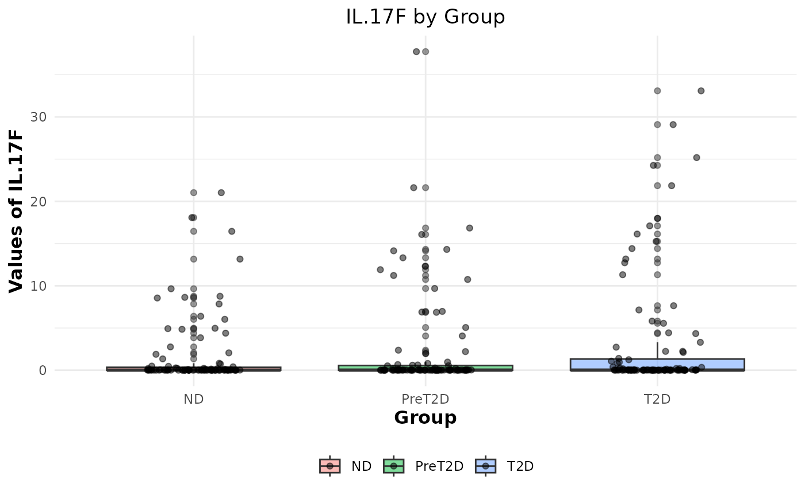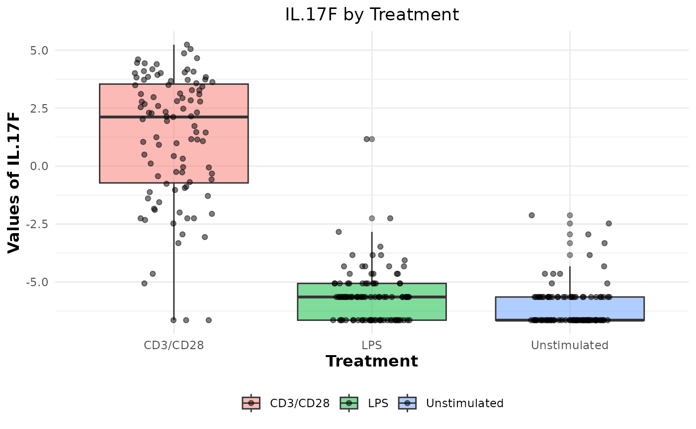

### 3. Skewness and Kurtosis

``` r
# Histogram for overall raw data
cyt_skku(data_df[, -c(1:3)], pdf_title = NULL, group_cols = NULL)

# Histogram with grouping (e.g., "Group")
cyt_skku(ExampleData1[, -c(2:3)], pdf_title = NULL, group_cols = c("Group"))
```

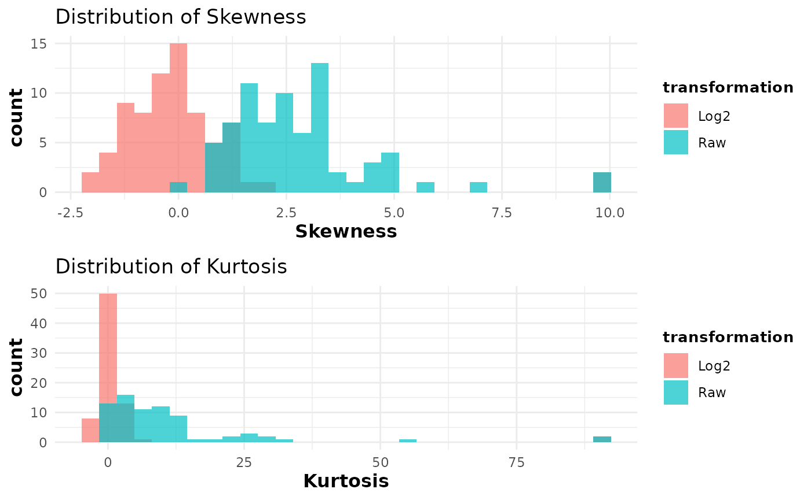

### 4. Error Bar Plots

#### Basic Error Bar Plot

``` r
# Generating basic error bar plots
data_df <- ExampleData1
cyt_errbp(
  data_df[, c("Group", "CCL.20.MIP.3A", "IL.10")],
  group_col = "Group",
  p_lab = FALSE,
  es_lab = FALSE,
  class_symbol = FALSE,
  x_lab = "Cytokines",
  y_lab = "Concentrations in log2 scale",
  log2 = TRUE
)
```

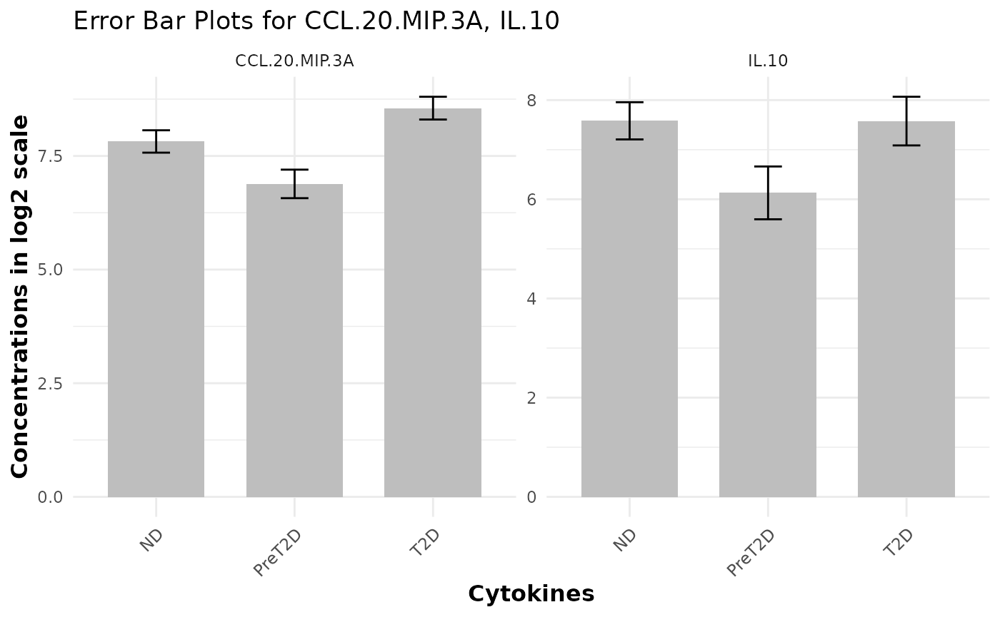

#### Enriched Error Bar Plot with p-values and Effect Sizes

``` r
# Generating Error Bar Plot enriched with p-value and effect size
data_df <- ExampleData1
cyt_errbp(
  data_df[, c("Group", "CCL.20.MIP.3A", "IL.10")],
  group_col = "Group",
  p_lab = TRUE,
  es_lab = TRUE,
  class_symbol = TRUE,
  x_lab = "Cytokines",
  y_lab = "Concentrations in log2 scale",
  log2 = TRUE
)
```


### 5. Univariate Analysis

#### Two Sample T-test and Mann Whitney U Test

``` r
# Performing Test
data_df <- ExampleData1[, -c(3)]
data_df <- dplyr::filter(data_df, Group != "ND", Treatment != "Unstimulated")
# Test example
cyt_ttest(
  data_df[, c(1:2, 5:6)],
  scale = "log2",
  verbose = TRUE,
  format_output = TRUE
)
#> $results
#>   Outcome Categorical      Comparison
#> 1   IFN.G       Group   PreT2D vs T2D
#> 2   IL.10       Group   PreT2D vs T2D
#> 3   IFN.G   Treatment CD3/CD28 vs LPS
#> 4   IL.10   Treatment CD3/CD28 vs LPS
#>                                                Test Estimate Statistic P_value
#> 1 Wilcoxon rank sum test with continuity correction   -2.463    1599.0   0.008
#> 2 Wilcoxon rank sum test with continuity correction   -0.956    1625.0   0.012
#> 3 Wilcoxon rank sum test with continuity correction    9.024    4132.5   0.000
#> 4 Wilcoxon rank sum test with continuity correction    1.690    3091.0   0.000
```

#### ANOVA Comparisons Test

``` r
# Perform ANOVA comparisons test (example with 2 cytokines)
data_df <- ExampleData1[, -c(3)]
cyt_anova(data_df[, c(1:2, 5:6)], format_output = TRUE)
#>                        Outcome Categorical            Comparison  P_adj
#> PreT2D-ND                IFN.G       Group             PreT2D-ND 0.0883
#> T2D-ND                   IFN.G       Group                T2D-ND 0.9779
#> T2D-PreT2D               IFN.G       Group            T2D-PreT2D 0.0550
#> PreT2D-ND1               IL.10       Group             PreT2D-ND 0.7745
#> T2D-ND1                  IL.10       Group                T2D-ND 0.1546
#> T2D-PreT2D1              IL.10       Group            T2D-PreT2D 0.0316
#> LPS-CD3/CD28             IFN.G   Treatment          LPS-CD3/CD28 0.0000
#> Unstimulated-CD3/CD28    IFN.G   Treatment Unstimulated-CD3/CD28 0.0000
#> Unstimulated-LPS         IFN.G   Treatment      Unstimulated-LPS 0.9988
#> LPS-CD3/CD281            IL.10   Treatment          LPS-CD3/CD28 0.0000
#> Unstimulated-CD3/CD281   IL.10   Treatment Unstimulated-CD3/CD28 0.0000
#> Unstimulated-LPS1        IL.10   Treatment      Unstimulated-LPS 0.0001
```

### 6. Multivariate Analysis

#### Partial Least Squares Discriminant Analysis (PLS-DA)

``` r
# cyt_plsda function.
data <- ExampleData1[, -c(3)]
data_df <- dplyr::filter(data, Group != "ND" & Treatment == "CD3/CD28")
cyt_splsda(
  data_df,
  pdf_title = NULL,
  colors = c("black", "purple"),
  bg = FALSE,
  scale = "log2",
  ellipse = TRUE,
  conf_mat = FALSE,
  var_num = 25,
  cv_opt = "loocv",
  comp_num = 2,
  pch_values = c(16, 4),
  group_col = "Group",
  group_col2 = "Treatment",
  roc = TRUE
)
```


#### Multivariate INTegration Partial Least Squares Discriminant Analysis (PLS-DA)

``` r
# cyt_mint_plsda function.
data_df <- ExampleData5[, -c(2, 4)]
data_df <- dplyr::filter(data_df, Group != "ND")

cyt_mint_splsda(
  data_df,
  group_col = "Group",
  batch_col = "Batch",
  colors = c("black", "purple"),
  ellipse = TRUE,
  var_num = 25,
  comp_num = 2,
  scale = "log2",
  verbose = FALSE
)
```

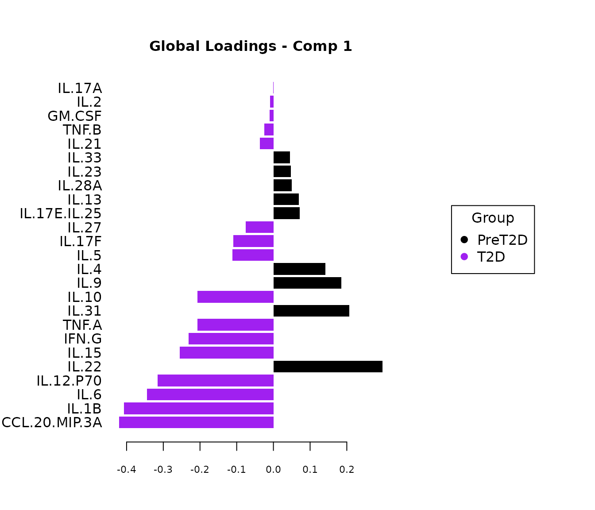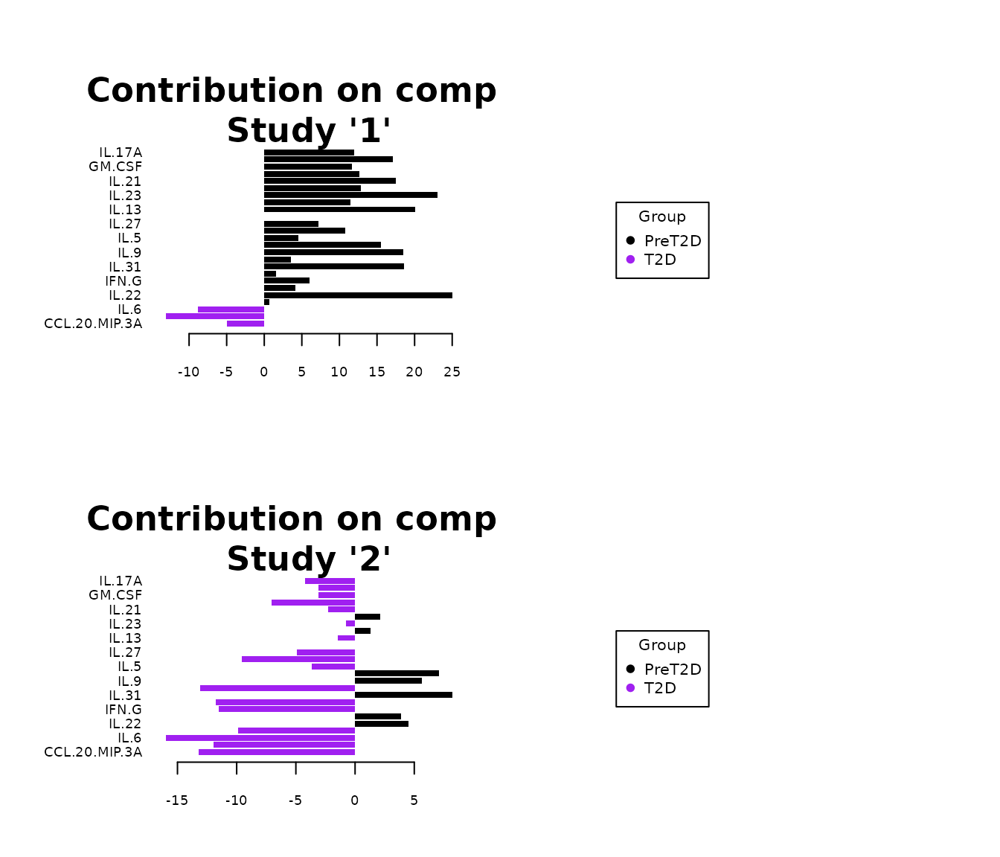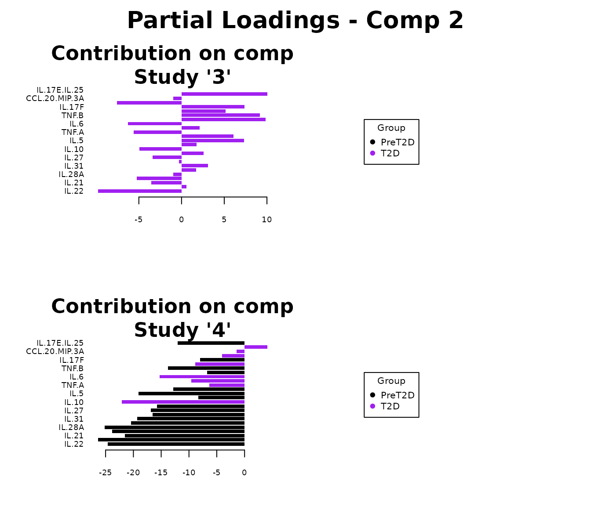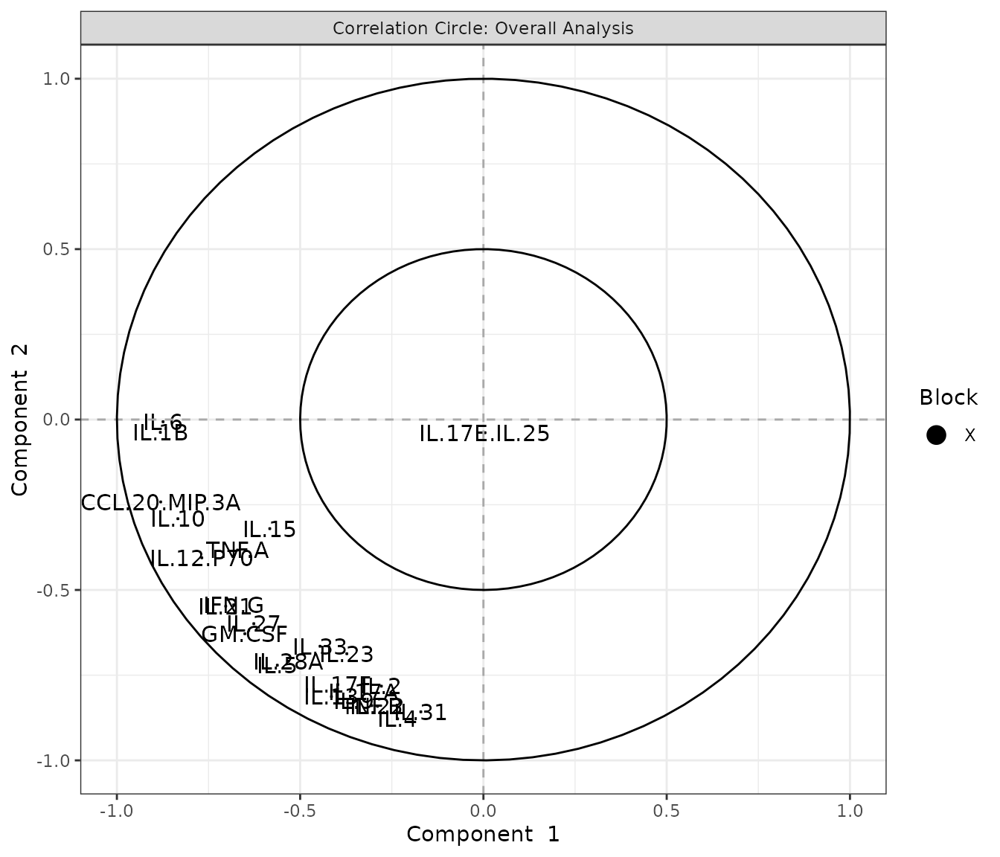

#### Principal Component Analysis (PCA)

``` r
data <- ExampleData1[, -c(3, 23)]
data_df <- dplyr::filter(data, Group != "ND" & Treatment != "Unstimulated")
cyt_pca(
  data_df,
  pdf_title = NULL,
  colors = c("black", "red2"),
  scale = "log2",
  comp_num = 2,
  pch_values = c(16, 4),
  group_col = "Group"
)
```

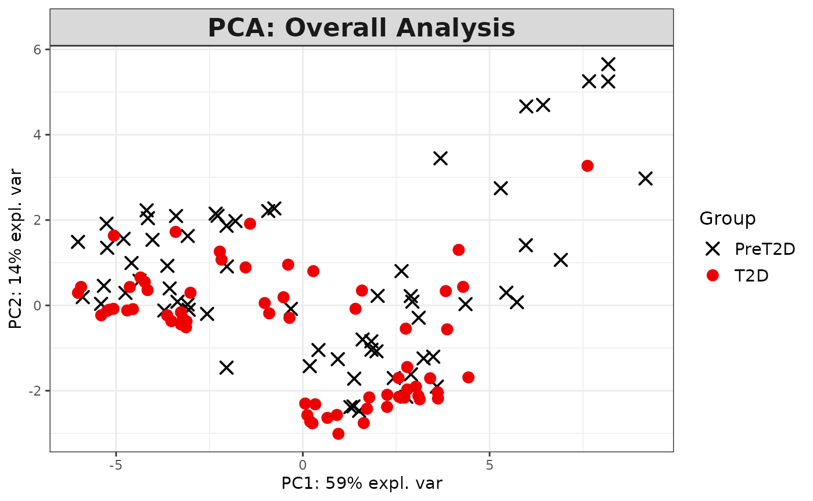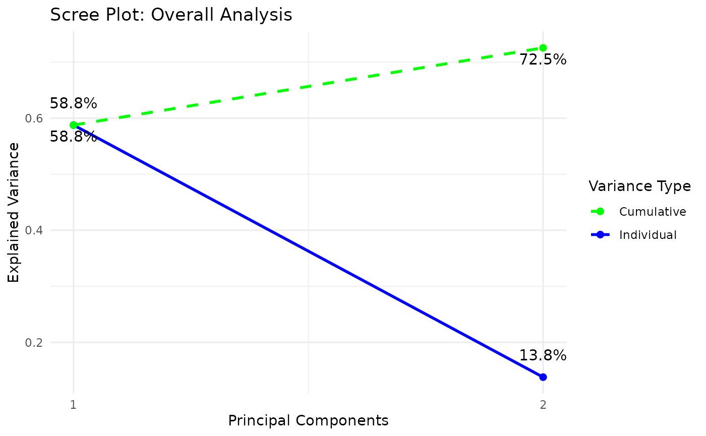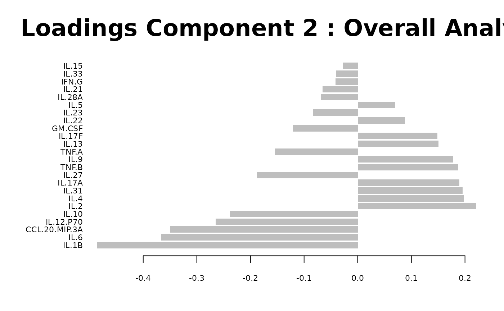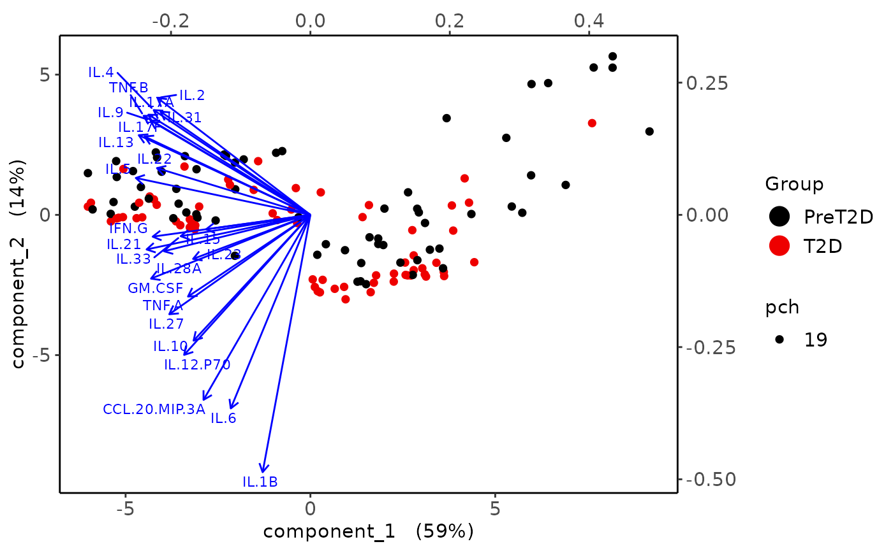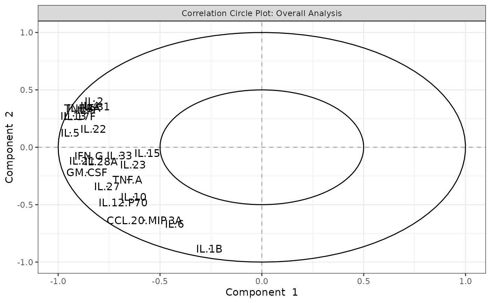

### 7. Statistical Visualizations

#### Volcano Plot

``` r
# Generating Volcano Plot
data_df <- ExampleData1[, -c(2:3)]
cyt_volc(
  data_df,
  group_col = "Group",
  cond1 = "T2D",
  cond2 = "ND",
  fold_change_thresh = 2.0,
  top_labels = 15
)
#> $`T2D vs ND`
```


#### Heatmap

``` r
# Generating Heat map
cyt_heatmap(
  data = data_df,
  scale = "log2", # Optional scaling
  annotation_col = "Group",
  title = NULL
)
```


#### Dual Flashlight Plot

``` r
# Generating dual flashlights plot
data_df <- ExampleData1[, -c(2:3)]
dfp <- cyt_dualflashplot(
  data_df,
  group_var = "Group",
  group1 = "T2D",
  group2 = "ND",
  ssmd_thresh = -0.2,
  log2fc_thresh = 1,
  top_labels = 10
)
# Print the plot
dfp
# Print the table data used for plotting
print(dfp$data, n = 25)
#> # A tibble: 25 × 11
#>    cytokine         mean_ND mean_PreT2D   mean_T2D variance_ND variance_PreT2D
#>    <chr>              <dbl>       <dbl>      <dbl>       <dbl>           <dbl>
#>  1 CCL.20.MIP.3A   634.        404.       887.        6.72e+ 5         2.74e+5
#>  2 GM.CSF            2.65        3.11       1.92      2.63e+ 1         3.14e+1
#>  3 IFN.G         57730.      18303.     61484.        2.86e+10         2.30e+9
#>  4 IL.10           979.        836.      1366.        1.99e+ 6         1.19e+6
#>  5 IL.12.P70        13.0        39.1       78.9       4.15e+ 2         2.56e+4
#>  6 IL.13          1064.       1543.      1122.        5.60e+ 6         1.11e+7
#>  7 IL.15             7.92        4.29       8.22      3.54e+ 1         2.58e+1
#>  8 IL.17A          352.        653.       615.        9.40e+ 5         2.88e+6
#>  9 IL.17E.IL.25      0.0101      0.0163     0.01      1.01e- 6         3.88e-3
#> 10 IL.17F            1.63        2.35       3.11      1.56e+ 1         3.37e+1
#> 11 IL.1B          2806.       2977.      4299.        6.63e+ 7         3.76e+7
#> 12 IL.2           9227.      10718.     16129.        2.60e+ 8         4.10e+8
#> 13 IL.21           205.        210.       316.        3.15e+ 5         2.49e+5
#> 14 IL.22             0.0513      0.0684     0.0633    4.58e- 3         4.51e-3
#> 15 IL.23             0.147       0.243      0.269     3.13e- 2         9.37e-2
#> 16 IL.27             0.0662      0.0834     0.106     6.18e- 3         5.66e-3
#> 17 IL.28A            0.0537      0.0710     0.0666    2.45e- 3         5.10e-3
#> 18 IL.31             0.0409      0.0905     0.0354    6.62e- 3         4.88e-2
#> 19 IL.33             1.17        1.43       1.16      2.09e+ 0         2.71e+0
#> 20 IL.4              0.344       0.707      0.297     4.24e- 1         2.96e+0
#> 21 IL.5            134.        340.       155.        1.09e+ 5         9.88e+5
#> 22 IL.6           4620.       5197.      8925.        2.86e+ 7         5.72e+7
#> 23 IL.9            203.        256.       254.        1.34e+ 5         2.11e+5
#> 24 TNF.A          5046.       3069.      5624.        7.02e+ 7         1.63e+7
#> 25 TNF.B             0.641       0.709      0.610     2.37e+ 0         2.76e+0
#> # ℹ 5 more variables: variance_T2D <dbl>, ssmd <dbl>, log2FC <dbl>,
#> #   SSMD_Category <chr>, Significant <lgl>
```

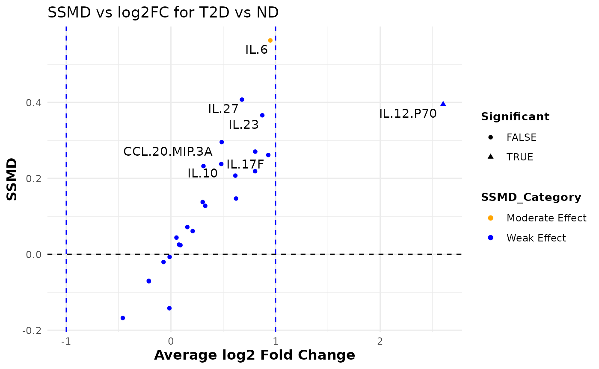

### 8. Machine Learning Models

#### Using XGBoost for classification

``` r
# Using XGBoost for classification
data_df0 <- ExampleData1
data_df <- data.frame(data_df0[, 1:3], log2(data_df0[, -c(1:3)]))
data_df <- data_df[, -c(2:3)]
data_df <- dplyr::filter(data_df, Group != "ND")

cyt_xgb(
  data = data_df,
  group_col = "Group",
  nrounds = 500,
  max_depth = 4,
  min_split_loss = 0,
  learning_rate = 0.05,
  nfold = 5,
  cv = TRUE,
  objective = "multi:softprob",
  eval_metric = "auc",
  early_stopping_rounds = NULL,
  top_n_features = 10,
  verbose = 0,
  plot_roc = TRUE,
  print_results = FALSE
)
```


#### Using Random Forest for classification

``` r
# Using Random Forest for classification
cyt_rf(
  data = data_df,
  group_col = "Group",
  k_folds = 5,
  ntree = 1000,
  mtry = 4,
  run_rfcv = TRUE,
  plot_roc = TRUE,
  verbose = FALSE
)
```


